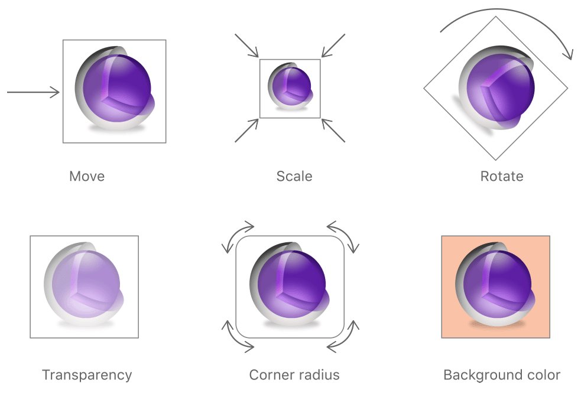

# Core Animation 基础知识

[原文：Core Animation Programming Guide-Core Animation Basics](https://developer.apple.com/library/content/documentation/Cocoa/Conceptual/CoreAnimation_guide/CoreAnimationBasics/CoreAnimationBasics.html)

Core Animation（后文简称CA）为view或其他可视元素执行动画提供了一个通用系统。CA并非view的替代品，相反，CA集成到了view，让view有更好的性能，并且让view可以对内容执行动画。为实现这一目的，layer将view的内容缓存为一个图像硬件可以直接操作【manipulated】的位图。有时候，这种缓存机制需要你重新考虑如何展示和管理app的内容，
但大多数情况下，你都意识不到你在使用CA。除了缓存view的内容，Core Animation also defines a way to specify arbitrary visual content, integrate that content with your views, and animate it along with everything else。

你使用CA来用动画的方式实现view或其他可视对象的变化。大多数变化都和修改可视对象的属性有关。例如，你可以使用CA来动画地改变view的position、size或opacity，CA会执行该属性从旧值到新值的动画。通常你不会像动画片那样，每秒60次的替换view的内容，相反，you use Core Animation to move a view’s content around the screen, fade that content in or out, apply arbitrary graphics transformations to the view, or change the view’s other visual attributes。

### layer提供了绘制和动画的基础【Basis】

layer对象是3D空间中的2D面，是CA的核心对象。和view类似，layer管理着2D面的geometry、content以及其他的可视属性。和view不同是，layers do not define their own appearance。layer仅仅管理着和位图有关的状态信息。位图可能是view绘制的，也可能是你直接设置的图片。因此，layer可以认为是model层，因为它主要管理数据。 This notion is important to remember because it affects the behavior of animations。

##### 基于layer的绘制模型
大多数layer不会执行实际的绘制，相反，layer接受app提供的内容，并缓存为位图，这个位图有时被称作backing store。当后续你修改layer的属性时，实际上只改变了layer的维护的状态信息。当变化触发动画时，CA将位图和状态信息传递给图形硬件，硬件会使用新的信息渲染位图，如图1-1所示。硬件处理位图执行动画，要比软件快的多。

这种操作静态位图的方式，使得基于layer的绘制和传统的基于view的方式显著的不同。基于view的绘制方式中，改变view的属性，通常会导致view执行drawRect方法，来根据新参数重新绘制内容。这种绘制方式开销很大，因为它要在主线程使用CPU绘制。CA尽可能的使用硬件操作缓冲位图的方式，在降低开销的情况下达到同样的效果。

尽管CA尽可能的使用缓存位图，你的app仍然要提供初始的内容，并在需要的时候，更新位图。关于如何提供为layer提供内容，请参考后续的[Providing a Layer’s Contents]()章节。

##### 基于layer的动画
layer对象的数据和状态信息，与visual presentation of that layer’s content onscreen解耦了。这种解耦让CA可以为自己插值【interpose itself】，并且动画式的执行从旧值到新值的变化。例如，改变layer的position的值，CA会将layer从旧位置移动到新指定的位置。其他可动画的属性也是类似的。图1-2展示了几种layer可以执行的动画。完整的可动画属性列表，请参考[Animatable Properties]()章节。

在动画过程中，CA使用硬件绘制每一帧。你所需要做的仅仅是设置初始值和结束值，其余的CA来做。你可以设置动画时间等属性；如果你没设置的话，CA也有合适的默认值。

关于如何初始化动画及配置动画属性，请参考[Animating Layer Content]()章节。

### layer对象定义了自己的geometry

layer的工作之一就是维护着内容的视觉geometry。视觉geometry包含了内容的bounds、position，以及是否有旋转、缩放等变形。和view类似，layer有frame、bounds rectangles等，你可以布局layer和它的内容。layer还有一些view没有的属性，例如anchor point， which defines the point around which manipulations occur。The way you specify some aspects of layer geometry also differs from how you specify that information for a view。

##### layer使用两种坐标系统
layer使用两种坐标系统，一种是基于点的坐标系统，一种是单位坐标系统。 Which coordinate system is used depends on the type of information being conveyed。基于点的坐标系统一般用于映射到屏幕坐标系统或其他layer的坐标系统时，例如layer的position属性。nit coordinates are used when the value should not be tied to screen coordinates because it is relative to some other value。例如layer的anchorPoint属性指定了一个相对于layer自身bound的一个点，它可以改变。

大多数使用基于点的坐标系统时，都是为了设置layer的尺寸和位置。你会使用bounds和position属性。bounds定义了layer自身的坐标系统，它包含了layer的尺寸。position定义了layer相对于它的父layer的坐标系统的位置。尽管layer有一个frame属性，that property is actually derived from the values in the bounds and position properties and is used less frequently。

layer的bounds和frame的方向和底层平台有关。图1-3展示了iOS和OSX平台上的默认方向。iOS系统的坐标系原点在左上方，而OSX的坐标系原点在左下方。如果你的代码要在iOS和OSX上共享，要考虑到这个不同。

图1-3中要注意的是图中心的position属性，这是几个受anchorPoint属性影响的属性之一。The anchor point represents the point from which certain coordinates originate，详情请参考[Anchor Points Affect Geometric Manipulations]()章节。

anchorPoint是使用单位坐标系统的属性之一，CA使用单位坐标系统来表示哪些可能随layer尺寸变化而改变的属性。你可以认为单位坐标系统是使用百分比值的系统，每个坐标的x或y值都在0到1之间。例如，在x轴上，最左边的坐标是0，最右边的坐标是1。y轴的值，和底层平台有关，如图1-4所示。

> **注意**：Until OS X 10.8, the geometryFlipped property was a way to change the default orientation of a layer’s y-axis when needed. Use of this property was sometimes necessary to correct the orientation of a layer when flip transforms were in involved. For example, if a parent view used a flip transform, the contents of its child views (and their corresponding layers) would often be inverted. In such cases, setting the geometryFlipped property of the child layers to YES was an easy way to correct the problem. In OS X 10.8 and later, AppKit manages this property for you and you should not modify it. For iOS apps, it is recommended that you do not use the geometryFlipped property at all.

不管是基于点的还是单位坐标系统，坐标值都是浮点型的。The use of floating-point numbers allows you to specify precise locations that might fall between normal coordinate values。使用浮点坐标值更方便，尤其是在打印时，或者在Retina屏显示时，Retina屏上一个点包含多个像素。浮点坐标值让你可以设置精确的值时忽略底层设备的分辨率。

##### Anchor Points Affect Geometric Manipulations
Geometry related manipulations of a layer occur relative to that layer’s anchor point，你可以使用anchorPoint来访问。当你使用position或transform时，anchorPoint的影响很明显。position属性始终相对于anchorPoint，对layer应用transformations也是相对于anchorPoint。

图1-5展示了修改anchorPoint的值会如何影响position，尽管没有移动在父layer的bounds中移动layer，将layer的anchorPoint从layer的中心修改到layer的原点时，依然改变了layer的position的值。

图1-6展示了改变anchorPoint的值会如何影响layer的transform。当你对layer应用rotation时，layer会围绕anchorPoint旋转。anchorPoint默认为layer的中心，此时旋转的效果和你预期是一样的。然而当你修改了anchorPoint，旋转的效果就变化了。

##### Layers Can Be Manipulated in Three Dimensions
每个layer都有两个变化矩阵来处理它和它的内容。transform属性适用于你想将transform应用于layer以及它的子layer。通常你想修改layer时会使用这个属性，例如你想临时的旋转、缩放或调整layer的位置。sublayerTransform属性则只应用于layer的子属性and is used most commonly to add a perspective visual effect to the contents of a scene。

Transforms work by multiplying coordinate values through a matrix of numbers to get new coordinates that represent the transformed versions of the original points. Because Core Animation values can be specified in three dimensions, each coordinate point has four values that must be multiplied through a four-by-four matrix, as shown in Figure 1-7. In Core Animation, the transform in the figure is represented by the CATransform3D type. Fortunately, you do not have to modify the fields of this structure directly to perform standard transformations. Core Animation provides a comprehensive set of functions for creating scale, translation, and rotation matrices and for doing matrix comparisons. In addition to manipulating transforms using functions, Core Animation extends key-value coding support to allow you to modify a transform using key paths. For a list of key paths you can modify, see [CATransform3D Key Paths](https://developer.apple.com/library/content/documentation/Cocoa/Conceptual/CoreAnimation_guide/Key-ValueCodingExtensions/Key-ValueCodingExtensions.html#//apple_ref/doc/uid/TP40004514-CH12-SW1)

Figure 1-8 shows the matrix configurations for some of the more common transformations you can make. Multiplying any coordinate by the identity transform returns the exact same coordinate. For other transformations, how the coordinate is modified depends entirely on which matrix components you change. For example, to translate along the x-axis only, you would supply a nonzero value for the tx component of the translation matrix and leave the ty and tz values to 0. For rotations, you would provide the appropriate sine and cosine values of the target rotation angle.

### layer树们从不同层面反映动画状态

app使用CA时会有3个layer树，内容要在屏幕上显示时，3个layer树扮演着不同的角色。

- model layer tree (or simply “layer tree”) 是你的app主要交互的树。这个树上的对象保存这动画的目标值，当你修改layer的属性时，值就会保存在这个树的对象中。
- presentation tree保存着动画运行时的当前值【in-flight】，layer tree保存着动画的目标值，而presentation-tree保存着当前正在屏幕上显示的值。你不应该修改这个树上对象的值，相反，你可以读取这些动画当前值，或许会根据这些值创建新的动画。
- render tree的对象执行实际的动画，是CA的私有树。

每个layer树都和view树结构类似，事实上，如果view树的每个view都开启了layer支持，那么layer树的初始结构和view树是一致的，但是你可以在layer树上添加额外的layer。你通常在需要优化app性能时，对那些不需要view的额外属性的内容使用layer。

对于layer tree的每个对象，presentation tree和render tree中都有一个对象的对象，如图1-10所示。之前提到过，app主要和layer tree交互，有时通过访问layer tree上某个对象的presentationLayer属性和presentation tree交互。访问presentation tree通常是为了读取动画执行过程中的属性值。

> **重要**：你应该只在动画执行时访问presentation tree，动画执行时，presentation tree包含了动画在屏幕上的当前值。这个行为和layer tree是不同的，layer tree反映了你代码最后设置的值，也就是动画的最终值。

### layer和view的关系
layer并非view的替代品，你无法只用layer来构建可视的界面，layer为view提供infrastructure。尤其是，layer能更简单的绘制和动画化view的内容，并且保持高帧率。然后，layer有很多事情做不了，它无法响应事件，不能实际绘制内容，也不在响应链中，当然还有很多其他不能做的事。因此，app需要view来处理上述的任务。

在iOS中，view默认都会绑定一个layer对象，不过在OSX中，你需要设置view是否需要layer。In OS X v10.8 and later, it probably makes sense to add layers to all of your views. However, you are not required to do so and can still disable layers in cases where the overhead is unwarranted and unneeded. Layers do increase your app’s memory overhead somewhat but their benefits often outweigh the disadvantage, so it is always best to test the performance of your app before disabling layer support.

如果你开启view对layer的支持，你创建的view被称作layer-backed view。对于layer-backed view，系统会为view创建layer，并保持layer和view的同步。iOS中所有的view都是layer-backed的， and most views in OS X are as well. However, in OS X, you can also create a layer-hosting view, which is a view where you supply the layer object yourself. For a layer-hosting view, AppKit takes a hands off approach with managing the layer and does not modify it in response to view changes.

> **注意** 对于layer-backed view，推荐的方式是设置view的属性，而不是直接设置layer的。在iOS中，view通常只是layer对象的thin wrapper，所以大部分属性可以直接设置给layer。但有些情况下，iOS/OSX中直接设置layer的某些属性时，可能效果并不是你想要的。文档会尽可能的指出这些特殊情况。

除了view关联的layer，你也可以创建独立的layer。你可以将独立layer添加到任意的layer上，包括和view关联的layer。You typically use standalone layer objects as part of a specific optimization path. For example, if you wanted to use the same image in multiple places, you could load the image once and associate it with multiple standalone layer objects and add those objects to the layer tree. Each layer then refers to the source image rather than trying to create its own copy of that image in memory。

关于如何为view启用layre，请参考[Enabling Core Animation Support in Your App]()章节。关于如何创建layer树，以及相关的tips，请参考[Building a Layer Hierarchy]()章节。
