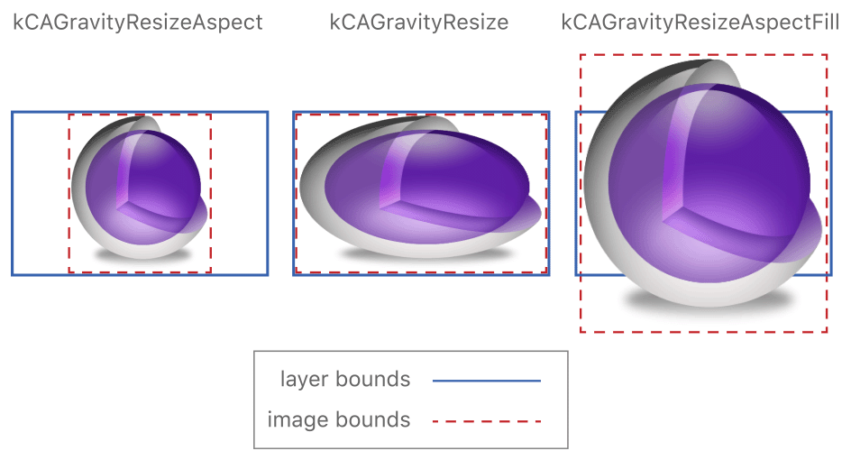

# Setting Up Layer Objects

[原文](https://developer.apple.com/library/content/documentation/Cocoa/Conceptual/CoreAnimation_guide/SettingUpLayerObjects/SettingUpLayerObjects.html#//apple_ref/doc/uid/TP40004514-CH13-SW12)

Layer objects are at the heart of everything you do with Core Animation. Layers manage your app’s visual content and provide options for modifying the style and visual appearance of that content. Although iOS apps have layer support enabled automatically, developers of OS X apps must enable it explicitly before they can take advantage of the performance benefits. Once enabled, you need to understand how to configure and manipulate your app’s layers to get the effects you want.

### Enabling Core Animation Support in Your App
In iOS apps, Core Animation is always enabled and every view is backed by a layer. In OS X, apps must explicitly enable Core Animation support by doing the following:

- Link against the QuartzCore framework. (iOS apps must link against this framework only if they use Core Animation interfaces explicitly.)
- Enable layer support for one or more of your NSView objects by doing one of the following:
	- In your nib files, use the View Effects inspector to enable layer support for your views. The inspector displays checkboxes for the selected view and its subviews. It is recommended that you enable layer support in the content view of your window whenever possible.
	- For views you create programmatically, call the view’s setWantsLayer: method and pass a value of YES to indicate that the view should use layers.
	
Enabling layer support in one of the preceding ways creates a layer-backed view. With a layer-backed view, the system takes responsibility for creating the underlying layer object and for keeping that layer updated. In OS X, it is also possible to create a layer-hosting view, whereby your app actually creates and manages the underlying layer object. (You cannot create layer-hosting views in iOS.) For more information on how to create a layer-hosting view, see Layer Hosting Lets You Change the Layer Object in OS X.

### Changing the Layer Object Associated with a View

Layer-backed views create an instance of the CALayer class by default, and in most cases you might not need a different type of layer object. However, Core Animation provides different layer classes, each of which provides specialized capabilities that you might find useful. Choosing a different layer class might enable you to improve performance or support a specific type of content in a simple way. For example, the CATiledLayer class is optimized for displaying large images in an efficient manner.

##### 替换view关联的layer class
You can change the type of layer used by an iOS view by overriding the view’s layerClass method and returning a different class object. Most iOS views create a CALayer object and use that layer as the backing store for its content. For most of your own views, this default choice is a good one and you should not need to change it. But you might find that a different layer class is more appropriate in certain situations. For example, you might want to change the layer class in the following situations:

- Your view draws content using Metal or OpenGL ES, in which case you would use a CAMetalLayer or CAEAGLLayer object.
- There is a specialized layer class that offers better performance.
- You want to take advantage of some specialized Core Animation layer classes, such as particle emitters or replicators.

Changing the layer class of a view is very straightforward; an example is shown in Listing 2-1. All you have to do is override the layerClass method and return the class object you want to use instead. Prior to display, the view calls the layerClass method and uses the returned class to create a new layer object for itself. Once created, a view’s layer object cannot be changed.

Listing 2-1  Specifying the layer class of an iOS view

```
+ (Class) layerClass {
   return [CAMetalLayer class];
}
```

For a list of layer classes and how you use them, see Different Layer Classes Provide Specialized Behaviors.

##### Changing the Layer Class Used By NSView

##### Layer Hosting Lets You Change the Layer Object in OS X

##### 不同的layer class提供特定的行为

Core Animation defines many standard layer classes, each of which was designed for a specific use case. The CALayer class is the root class for all layer objects. It defines the behavior that all layer objects must support and is the default type used by layer-backed views. However, you can also specify one of the layer classes in Table 2-1.

Table 2-1  CALayer subclasses and their uses

- CAEmitterLayer

Used to implement a Core Animation–based particle emitter system. The emitter layer object controls the generation of the particles and their origin.

- CAGradientLayer

Used to draw a color gradient that fills the shape of the layer (within the bounds of any rounded corners).

- CAMetalLayer

Used to set up and vend drawable textures for rendering layer content using Metal.

- CAEAGLLayer/CAOpenGLLayer

Used to set up the backing store and context for rendering layer content using OpenGL ES (iOS) or OpenGL (OS X).

- CAReplicatorLayer

Used when you want to make copies of one or more sublayers automatically. The replicator makes the copies for you and uses the properties you specify to alter the appearance or attributes of the copies.

- CAScrollLayer

Used to manage a large scrollable area composed of multiple sublayers.

- CAShapeLayer

Used to draw a cubic Bezier spline. Shape layers are advantageous for drawing path-based shapes because they always result in a crisp path, as opposed to a path you draw into a layer’s backing store, which would not look as good when scaled. However, the crisp results do involve rendering the shape on the main thread and caching the results.

- CATextLayer

Used to render a plain or attributed string of text.

- CATiledLayer

Used to manage a large image that can be divided into smaller tiles and rendered individually with support for zooming in and out of the content.

- CATransformLayer

Used to render a true 3D layer hierarchy, rather than the flattened layer hierarchy implemented by other layer classes.

- QCCompositionLayer

Used to render a Quartz Composer composition. (OS X only)

### 为layer提供内容

Layers are data objects that manage content provided by your app. A layer’s content consists of a bitmap containing the visual data you want to display. You can provide the content for that bitmap in one of three ways:

- Assign an image object directly to the layer object’s contents property. (This technique is best for layer content that never, or rarely, changes.)
- Assign a delegate object to the layer and let the delegate draw the layer’s content. (This technique is best for layer content that might change periodically and can be provided by an external object, such as a view.)
- Define a layer subclass and override one of its drawing methods to provide the layer contents yourself. (This technique is appropriate if you have to create a custom layer subclass anyway or if you want to change the fundamental drawing behavior of the layer.)

The only time you need to worry about providing content for a layer is when you create the layer object yourself. If your app contains nothing but layer-backed views, you do not have to worry about using any of the preceding techniques to provide layer content. Layer-backed views automatically provide the contents for their associated layers in the most efficient way possible

##### 使用image作为layer的内容
Because a layer is just a container for managing a bitmap image, you can assign an image directly to the layer’s contents property. Assigning an image to the layer is easy and lets you specify the exact image you want to display onscreen. layer引用你提供的image，而不会去copy一份，如果你在多处使用同一张图片，这种策略可以节省内存。

The image you assign to a layer must be a CGImageRef type. (In OS X v10.6 and later, you can also assign an NSImage object.) When assigning images, 
提供的image的分辨率应该和设备分辨率一致，对于Retina屏，这也许需要你adjust the contentsScale property of the image。 For information on using high-resolution content with your layers, see Working with High-Resolution Images.

##### 使用delegate来为layer提供内容
If the content of your layer changes dynamically, you can use a delegate object to provide and update that content when needed. At display time, the layer calls the methods of your delegate to provide the needed content:

- If your delegate implements the displayLayer: method, that implementation is responsible for creating a bitmap and assigning it to the layer’s contents property.
- If your delegate implements the drawLayer:inContext: method, Core Animation creates a bitmap, creates a graphics context to draw into that bitmap, and then calls your delegate method to fill the bitmap. All your delegate method has to do is draw into the provided graphics context.

The delegate object must implement either the displayLayer: or drawLayer:inContext: method. If the delegate implements both the displayLayer: and drawLayer:inContext: method, the layer calls only the displayLayer: method.

Overriding the displayLayer: method is most appropriate for situations when your app prefers to load or create the bitmaps it wants to display. Listing 2-3 shows a sample implementation of the displayLayer: delegate method. In this example, the delegate uses a helper object to load and display the image it needs. The delegate method selects which image to display based on its own internal state, which in the example is a custom property called displayYesImage.

Listing 2-3  Setting the layer contents directly

```
- (void)displayLayer:(CALayer *)theLayer {
    // Check the value of some state property
    if (self.displayYesImage) {
        // Display the Yes image
        theLayer.contents = [someHelperObject loadStateYesImage];
    }
    else {
        // Display the No image
        theLayer.contents = [someHelperObject loadStateNoImage];
    }
}
```

If you do not have prerendered images or a helper object to create bitmaps for you, your delegate can draw the content dynamically using the drawLayer:inContext: method. Listing 2-4 shows a sample implementation of the drawLayer:inContext: method. In this example, the delegate draws a simple curved path using a fixed width and the current rendering color.

Listing 2-4  Drawing the contents of a layer

```
- (void)drawLayer:(CALayer *)theLayer inContext:(CGContextRef)theContext {
    CGMutablePathRef thePath = CGPathCreateMutable();
 
    CGPathMoveToPoint(thePath,NULL,15.0f,15.f);
    CGPathAddCurveToPoint(thePath,
                          NULL,
                          15.f,250.0f,
                          295.0f,250.0f,
                          295.0f,15.0f);
 
    CGContextBeginPath(theContext);
    CGContextAddPath(theContext, thePath);
 
    CGContextSetLineWidth(theContext, 5);
    CGContextStrokePath(theContext);
 
    // Release the path
    CFRelease(thePath);
}
```

For layer-backed views with custom content, you should continue to override the view’s methods to do your drawing. 
layer-backed view会自动将自己设置为layer的delegate，并且实现必要的delegate方法，你不应该修改相关的配置。相反，你应该实现view的drawRect:方法来绘制内容。

In OS X v10.8 and later, an alternative to drawing is to provide a bitmap by overriding the wantsUpdateLayer and updateLayer methods of your view. Overriding wantsUpdateLayer and returning YES causes the NSView class to follow an alternate rendering path. Instead of calling drawRect:, the view calls your updateLayer method, the implementation of which must assign a bitmap directly to the layer’s contents property. This is the one scenario where AppKit expects you to set the contents of a view’s layer object directly.

##### 通过子类为layer提供内容

If you are implementing a custom layer class anyway, you can override the drawing methods of your layer class to do any drawing. It is uncommon for a layer object to generate custom content itself, but layers certainly can manage the display of content. For example, the CATiledLayer class manages a large image by breaking it into smaller tiles that can be managed and rendered individually. Because only the layer has information about which tiles need to be rendered at any given time, it manages the drawing behavior directly.

When subclassing, you can use either of the following techniques to draw your layer’s content:

- Override the layer’s display method and use it to set the contents property of the layer directly.
- Override the layer’s drawInContext: method and use it to draw into the provided graphics context.

Which method you override depends on how much control you need over the drawing process. The display method is the main entry point for updating the layer’s contents, so overriding that method puts you in complete control of the process. Overriding the display method also means that you are responsible for creating the CGImageRef to be assigned to the contents property. If you just want to draw content (or have your layer manage the drawing operation), you can override the drawInContext: method instead and let the layer create the backing store for you.

##### 调整你提供给layer的内容
When you assign an image to the contents property of a layer, the layer’s contentsGravity property determines how that image is manipulated to fit the current bounds. 
默认情况下，如果image比bounds大或小，layer会缩放image来fit within自己的空间。aspect ratio of the layer’s bounds is different than the aspect ratio of the image，图片将会变形。你可以使用contentsGravity属性来让显示效果尽可能的好。

The values you can assign to the contentsGravity property are divided into two categories:

- The position-based gravity constants allow you to pin your image to a particular edge or corner of the layer’s bounds rectangle without scaling the image.
- The scaling-based gravity constants allow you to stretch the image using one of several options, some of which preserve the aspect ratio and some of which do not.

Figure 2-1 shows the how the position-based gravity settings affect your images. With the exception of the kCAGravityCenter constant, each constant pins the image to a particular edge or corner of the layer’s bounds rectangle. The kCAGravityCenter constant centers the image in the layer. None of these constants cause the image to be scaled in any way, so the image is always rendered at its original size. If the image is bigger than the layer’s bounds, this may result in portions of the image being clipped, and if the image is smaller, the portions of the layer that are not covered by the image reveal the layer’s background color, if set.


Figure 2-2 shows how the scaling-based gravity constants affect your images. All of these constants scale the image if it does not fit exactly within the bounds rectangle of the layer. The difference between the modes is how they deal with the image’s original aspect ratio. Some modes preserve it and others do not. By default, a layer’s contentsGravity property is set to the kCAGravityResize constant, which is the only mode that does not preserve the image aspect ratio.



##### 处理高分辨率image
layer并不了解底层设备的分辨率，A layer simply stores a pointer to your bitmap and displays it in the best way possible given the available pixels。如果你直接将image设置给layer的content属性，你需要设置layer的contentsScale属性，来告诉CA关于image的分辨率信息。The default value of the property is 1.0, which is appropriate for images intended to be displayed on standard resolution screens. If your image is intended for a Retina display, set the value of this property to 2.0

只有你直接给layer的content属性设置image时，你才需要设置layer的contentsScale属性，layer-backed的view（无论在iOS还是OSX）会根据屏幕分辨率和内容自动的设置关联layer的contentsScale。For example, if you assign an NSImage object to the contents property of a layer in OS X, AppKit looks to see if there are both standard- and high-resolution variants of the image. If there are, AppKit uses the correct variant for the current resolution and sets the value of the contentsScale property to match.

In OS X, the position-based gravity constants affect the way image representations are chosen from an NSImage object assigned to the layer. Because these constants do not cause the image to be scaled, Core Animation relies on the contentsScale property to pick the image representation with the most appropriate pixel density.

In OS X, the layer’s delegate can implement the layer:shouldInheritContentsScale:fromWindow: method and use it to respond to changes in the scale factor. AppKit automatically calls that method whenever the resolution for a given window changes, possibly because the window moved between a standard-resolution and high-resolution screens. Your implementation of this method should return YES if the delegate supports changing the resolution of the layer’s image. The method should then update the layer’s contents as needed to reflect the new resolution.

### Adjusting a Layer’s Visual Style and Appearance

Layer objects have built in visual adornments such as a border and background color that you can use to supplement the layer’s main contents. Because these visual adornments do not require any rendering on your part, they make it possible to use layers as standalone entities in some situations. All you have to do is set a property on the layer and the layer handles the necessary drawing, including any animations. For additional illustrations of how these visual adornments affect the appearance of a layer, see Layer Style Property Animations.

#####  layer有自己的背景及描边

A layer can display a filled background and a stroked border in addition to its image-based contents. The background color is rendered behind the layer’s contents image and the border is rendered on top of that image, as shown in Figure 2-3. [If the layer contains sublayers, they also appear underneath the border](). Because the background color sits behind your image, that color shines through any transparent portions of your image.


Listing 2-5 shows the code needed to set the background color and border for a layer. All of these properties are animatable.

Listing 2-5  Setting the background color and border of a layer

```
myLayer.backgroundColor = [NSColor greenColor].CGColor;
myLayer.borderColor = [NSColor blackColor].CGColor;
myLayer.borderWidth = 3.0;
```

> Note: You can use any type of color for the background of a layer, including colors that have transparency or use a pattern image. [When using pattern images, though, be aware that Core Graphics handles the rendering of the pattern image and does so using its standard coordinate system, which is different than the default coordinate system in iOS. As such, images rendered on iOS appear upside down by default unless you flip the coordinates]().

如果你设置layer的背景色为不透明色，最好将layer的opaque属性设置为YES。这样做可以提升layer合成时的性能，并且消除layer的backing store的alpha channel。但是，如果layer的corner radius不为0，你不能将layer标记为opaque。

##### Layers Support a Corner Radius

You can create a rounded rectangle effect for your layer by adding a corner radius to it. A corner radius is a visual adornment that masks part of the corners of the layer’s bounds rectangle to allow the underlying content to show through, as shown in Figure 2-4. **Because it involves applying a transparency mask, the corner radius does not affect the image in the layer’s contents property unless the masksToBounds property is set to YES. However, the corner radius always affects how the layer’s background color and border are drawn.**


To apply a corner radius to your layer, specify a value for the cornerRadius property of the layer. The radius value you specify is measured in points and applied to all four corners of the layer prior to display.

##### Layers Support Built-In Shadows

The CALayer class includes several properties for configuring a shadow effect. A shadow adds depth to the layer by making it appear as if it is floating above its underlying content. This is another type of visual adornment that you might find useful in specific situations for your app. With layers, you can control the shadow’s color, placement relative to the layer’s content, opacity, and shape.

The opacity value for layer shadows is set to 0 by default, which effectively hides the shadow. Changing the opacity to a nonzero value causes Core Animation to draw the shadow. Because shadows are positioned directly under the layer by default, you might also need to change the shadow’s offset before you can see it. It is important to remember, though, that the offsets you specify for the shadow are applied using the layer’s native coordinate system, which is different on iOS and OS X. Figure 2-5 shows a layer with a shadow that extends down and to the right of the layer. In iOS, this requires specifying a positive value for the y axis but in OS X the value needs to be negative.


When adding shadows to a layer, the shadow is part of the layer’s content but actually extends outside the layer’s bounds rectangle. As a result, if you enable the masksToBounds property for the layer, the shadow effect is clipped around the edges. If your layer contains any transparent content, this can cause an odd effect where the portion of the shadow directly under your layer is still visible but the part extending beyond your layer is not. If you want a shadow but also want to use bounds masking, you use two layers instead of one. Apply the mask to the layer containing your content and then embed that layer inside a second layer of the exact same size that has the shadow effect enabled.

For examples of how shadows are applied to layers, see Shadow Properties.


Filters Add Visual Effects to OS X Views
In OS X apps, you can apply Core Image filters directly to the contents of your layers. You might do this to blur or sharpen your layer’s contents, to change the colors, to distort the content, or to perform many other types of operations. For example, an image processing program might use these filters to modify an image nondestructively while a video editing program might use them to implement different types of video transition effects. And because the filters are applied to the layer’s content in hardware, rendering is fast and smooth.

Note: You cannot add filters to layer objects in iOS.

For a given layer, you can apply filters to both the foreground and background content of the layer. The foreground content consists of everything that the layer itself contains, including the image in its contents property, its background color, its border, and the content of its sublayers. The background content is the content that is directly under the layer but not actually part of the layer itself. The background content of most layers is the content of its immediate superlayer, which may be wholly or partially obscured by the layer. For example, you might apply a blur filter to the background content when you want the user to focus on the layer’s foreground content.

You specify filters by adding CIFilter objects to the following properties of your layer:

The filters property contains an array of filters that affect the layer’s foreground content only.
The backgroundFilters property contains an array of filters that affect the layer’s background content only.
The compositingFilter property defines how the layer’s foreground and background content are composited together.
To add a filter to a layer, you must first locate and create the CIFilter object and then configure it before adding it to your layer. The CIFilter class includes several class methods for locating the available Core Image filters, such as the filterWithName: method. Creating the filter is only the first step, though. Many filters have parameters that define how the filter modifies an image. For example, a box blur filter has an input radius parameter that affects the amount of blur that is applied. You should always provide values for these parameters as part of the filter configuration process. However, one common parameter that you do not need to specify is the input image, which is provided by the layer itself.

When adding filters to layers, it is best to configure the filter parameters prior to adding the filter to the layer. The main reason for doing so is that once added to the layer, you cannot modify the CIFilter object itself. However, you can use the layer’s setValue:forKeyPath: method to change filter values after the fact.

Listing 2-6 shows how to create and apply a pinch distortion filter to a layer object. This filter pinches the source pixels of the layer inward, distorting those pixels closest to the specified center point the most. Notice in the example that you do not need to specify the input image for the filter because the layer’s image is used automatically.

Listing 2-6  Applying a filter to a layer

```
CIFilter* aFilter = [CIFilter filterWithName:@"CIPinchDistortion"];
[aFilter setValue:[NSNumber numberWithFloat:500.0] forKey:@"inputRadius"];
[aFilter setValue:[NSNumber numberWithFloat:1.25] forKey:@"inputScale"];
[aFilter setValue:[CIVector vectorWithX:250.0 Y:150.0] forKey:@"inputCenter"];
 
myLayer.filters = [NSArray arrayWithObject:aFilter];
```

For information about the available Core Image filters, see Core Image Filter Reference.

### The Layer Redraw Policy for OS X Views Affects Performance
In OS X, layer-backed views support several different policies for determining when to update the underlying layer’s contents. Because there are differences between the native AppKit drawing model and the one introduced by Core Animation, these policies make it easier to migrate your older code over to Core Animation. You can configure these policies on a view-by-view basis to ensure the best performance for each of your views.

Each view defines a layerContentsRedrawPolicy method that returns the redraw policy for the view’s layer. You set the policy using the setLayerContentsRedrawPolicy: method. To preserve compatibility with its traditional drawing model, AppKit sets the redraw policy to NSViewLayerContentsRedrawDuringViewResize by default. However, you can change the policy to any of the values in Table 2-2. Notice that the recommended redraw policy is not the default policy.

Table 2-2  Layer redraw policies for OS X views

- NSViewLayerContentsRedrawOnSetNeedsDisplay

This is the recommended policy. With this policy, view geometry changes do not automatically cause the view to update its layer’s contents. Instead, the layer’s existing contents are stretched and manipulated to facilitate the geometry changes. To force the view to redraw itself and update the layer’s contents, you must explicitly call the view’s setNeedsDisplay: method.

This policy most closely represents the standard behavior for Core Animation layers. However, it is not the default policy and must be set explicitly.

- NSViewLayerContentsRedrawDuringViewResize

This is the default redraw policy. This policy maintains maximum compatibility with traditional AppKit drawing by recaching the layer’s contents whenever the view’s geometry changes. This behavior results in the view’s drawRect: method being called multiple times on your app’s main thread during the resize operation.

- NSViewLayerContentsRedrawBeforeViewResize

With this policy, AppKit draws the layer at its final size prior to any resize operations and caches that bitmap. The resize operation uses the cached bitmap as the starting image, scaling it to fit the old bounds rectangle. It then animates the bitmap to its final size. This behavior can cause the view’s contents to appear stretched or distorted at the beginning of an animation and is better in situations where the initial appearance is not important or not noticeable.

- NSViewLayerContentsRedrawNever

With this policy, AppKit does not update the layer at all, even when you call the setNeedsDisplay: method. This policy is most appropriate for views whose contents never change and where the size of the view changes infrequently if at all. For example, you might use this for views that display fixed-size content or background elements.

View redraw policies alleviate the need to use standalone sublayers to improve drawing performance. Prior to the introduction of view redraw policies, there were some layer-backed views that drew more frequently than was needed and thereby caused performance issues. The solution to these performance issues was to use sublayers to present those portions of the view’s content that did not require regular redrawing. With the introduction of redraw policies in OS X v10.6, it is now recommended that you set a layer-backed view’s redraw policy to an appropriate value, rather than creating explicit sublayer hierarchies.

### Adding Custom Properties to a Layer

The CAAnimation and CALayer classes extend the key-value coding conventions to support custom properties. You can use this behavior to add data to a layer and retrieve it using a custom key you define. You can even associate actions with your custom properties so that when you change the property, a corresponding animation is performed.

For information about how to set and get custom properties, see Key-Value Coding Compliant Container Classes. For information about adding actions to your layer objects, see Changing a Layer’s Default Behavior.

### Printing the Contents of a Layer-Backed View

During printing, layers redraw their contents as needed to accommodate the printing environment. Whereas Core Animation normally relies on cached bitmaps when rendering to the screen, it redraws that content when printing. In particular, if a layer-backed view uses the drawRect: method to provide the layer contents, Core Animation calls drawRect: again during printing to generate the printed layer contents.


