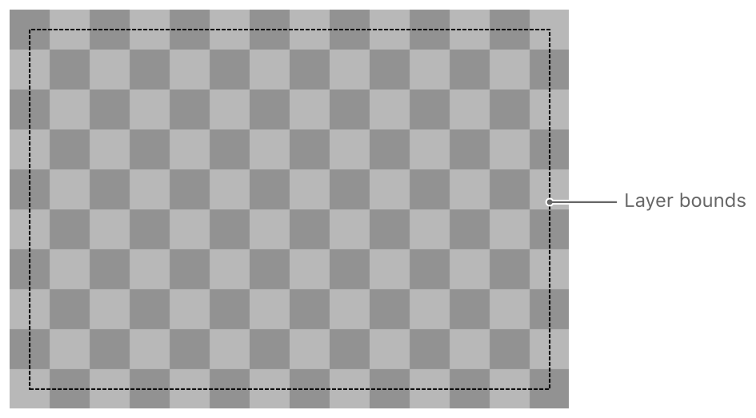
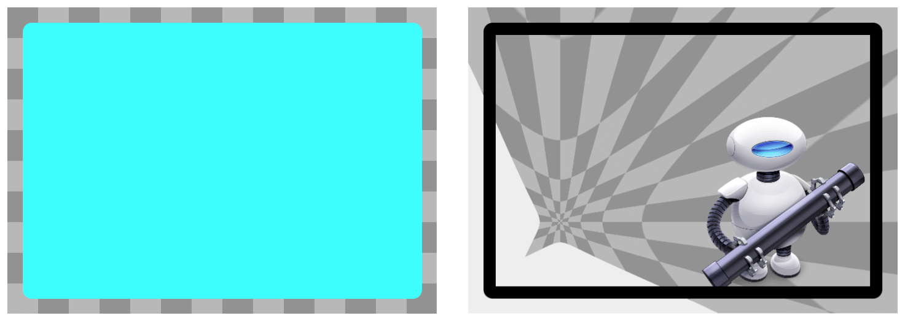
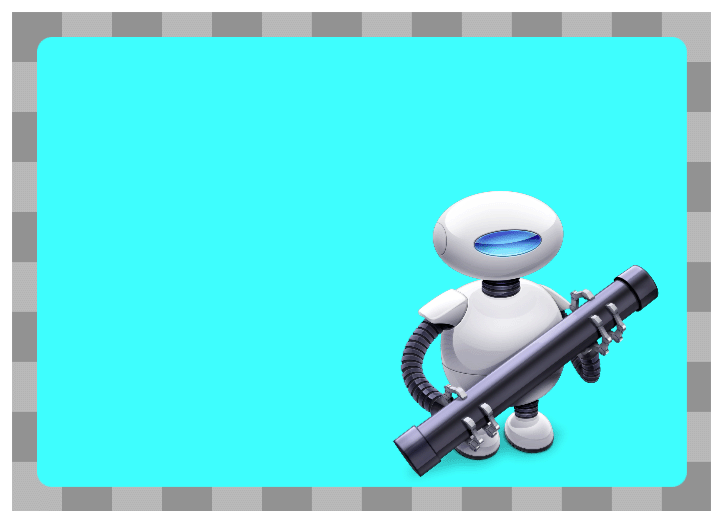
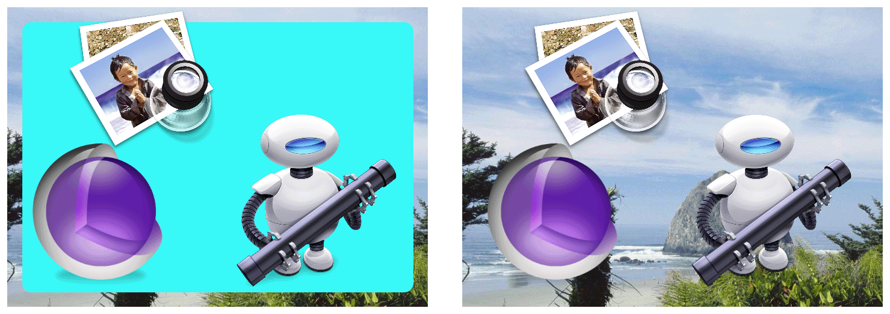
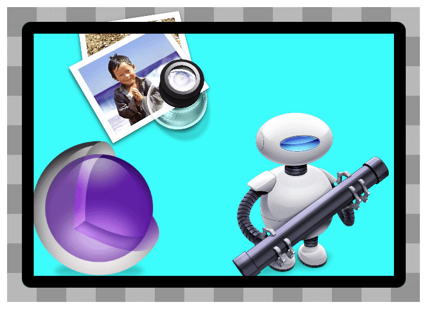
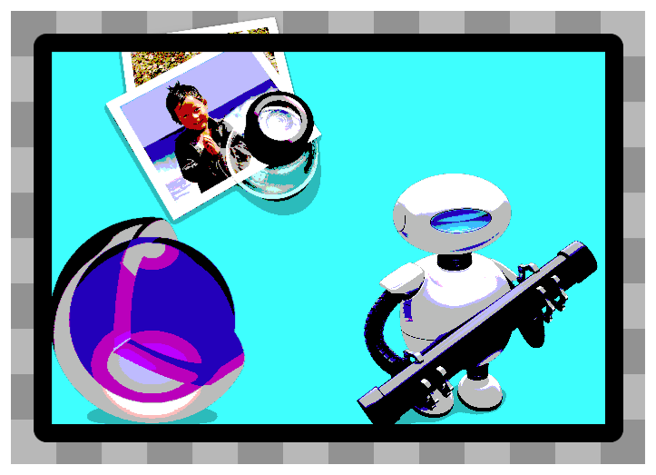
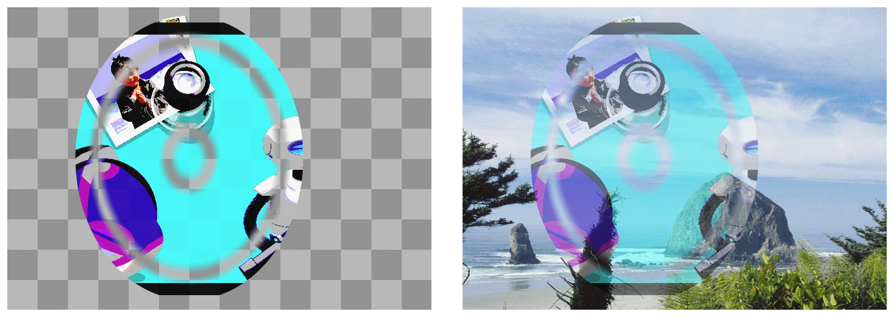

# Layer Style Property Animations

During the rendering process, Core Animation takes different attributes of the layer and renders them in a specific order. This order determines the final appearance of the layer. This chapter illustrates the rendered results achieved by setting different layer style properties.

> Note: The layer style properties available on Mac OS X and iOS differ and are noted throughout this chapter.

### Geometry Properties

A layer’s geometry properties specify how it is displayed relative to its parent layer. The geometry also specifies the radius used to round the layer corners and a transform that is applied to the layer and its sublayers. Figure A-1 shows the bounding rectangle of the example layer.

The following CALayer properties specify a layer’s geometry:

- bounds
- position
- **frame (computed from the bounds and position and is not animatable)**
- anchorPoint
- cornerRadius
- transform
- zPosition

> iOS Note: The cornerRadius property is supported only in iOS 3.0 and later.

### Background Properties

The first thing Core Animation renders is the layer’s background. You can specify a color for the background. In OS X, you can also specify a Core Image filter that you want to apply to the background content. Figure A-2 shows two versions of a sample layer. The layer on the left has its backgroundColor property set while the layer on the right has no background color but does have a border some content and a pinch distortion filter assigned to its backgroundFilters property.

The background filter is applied to the content that lies behind the layer, which primarily consists of the parent layer’s content. You might use a background filter to make the foreground layer content stand out; for example, by applying a blur filter.

The following CALayer properties affect the display of a layer’s background:

- backgroundColor
- backgroundFilters (not supported in iOS)

> Platform Note: In iOS, the backgroundFilters property is exposed in the CALayer class but the filters you assign to this property are ignored.

### Layer Content

If the layer has any content, that content is rendered on top of the background color. You can provide layer content by setting a bitmap directly, by using a delegate to specify the content, or by subclassing the layer and drawing the content directly. And you can use many different drawing technologies (including Quartz, Metal, OpenGL, and Quartz Composer) to provide that content. Figure A-3 shows a sample layer whose contents are a bitmap that was set directly. The bitmap content consists of a largely transparent space with the Automator icon in the lower right corner.

Layers with a corner radius do not automatically clip their contents; however, setting the layer’s masksToBounds property to YES does cause the layer to clip to its corner radius.

The following CALayer properties affect the display of a layer’s content:

- contents
- contentsGravity
- masksToBounds

### Sublayers Content

Any layer may contain one or more child layers, known as sublayers. ***Sublayers are rendered recursively and positioned relative to the parent layer's bounds rectangle. In addition, Core Animation applies the parent layer’s sublayerTransform to each sublayer relative to the parent layer’s anchor point.*** You can use the sublayer transform to apply perspective and other effects to all of the layers equally. Figure A-4 shows a sample layer with two sublayers. The version on the left includes a background color while the version on the right does not.

Setting the masksToBounds property of a layer to YES causes any sublayers to be clipped to the bounds of the layer.

The following CALayer properties affect the display of a layer’s sublayers:

- sublayers
- masksToBounds
- sublayerTransform

### Border Attributes

A layer can display an optional border using a specified color and width. The border follows the bounds rectangle of the layer and takes into account any corner radius values. Figure A-5 shows a sample layer after applying a border. **Notice that content and sublayers that are outside the layer’s bounds are rendered underneath the border.**

The following CALayer properties affect the display of a layer’s borders:

- borderColor
- borderWidth

> Platform Note: The borderColor and borderWidth properties are supported only in iOS 3.0 and later.

### Filters Property

In OS X, you may apply one or more filters to the layer’s content and use a custom compositing filter to specify how the layer’s contents blend with the content of its underlying layer. Figure A-6 shows a sample layer with the Core Image posterize filter applied.

The following CALayer property specifies a layers content filters:

- filters
- compositingFilter

> Platform Note: In iOS, layers ignore any filters you assign to them.

### Shadow Properties

Layers can display shadow effects and configure their shape, opacity, color, offset, and blur radius. If you do not specify a custom shadow shape, **the shadow is based on the portions of the layer that are not fully transparent.** Figure A-7 shows several different versions of the same sample layer with a red shadow applied. **The left and middle versions include a background color so the shadow appears only around the border of the layer. However, the version on the right does not include a background color. In this case, the shadow is applied to the layer’s content, border, and sublayers.**

The following CALayer properties affect the display of a layer’s shadow:

- shadowColor
- shadowOffset
- shadowOpacity
- shadowRadius
- shadowPath

> Platform Note: The shadowColor, shadowOffset, shadowOpacity, and shadowRadius properties are supported in iOS 3.2 and later. The shadowPath property is supported in iOS 3.2 and later and in OS X v10.7 and later.

### Opacity Property

The opacity property of a layer determines how much background content shows through the layer. Figure A-8 shows a sample layer whose opacity is set to 0.5. This allows portions of the background image to show through.

The following CALayer property specifies the opacity of a layer:

- opacity

### Mask Properties

You can use a mask to obscure all or part of a layer’s contents. **The mask is itself a layer object whose alpha channel is used to determine what is blocked and what is transmitted. Opaque portions of the mask layer’s contents allow the underlying layer content to show through while transparent portions partially or fully obscure the underlying content.** Figure A-9 shows a sample layer composited with a mask layer and two different backgrounds. In the left version, the layer’s opacity is set to 1.0. In the right version, the layer’s opacity is set to 0.5, which increases the amount of background content that is transmitted through the masked portion of the layer.

The following CALayer property specifies the mask for a layer:

- mask

> Platform Note: The mask property is supported in iOS 3.0 and later.