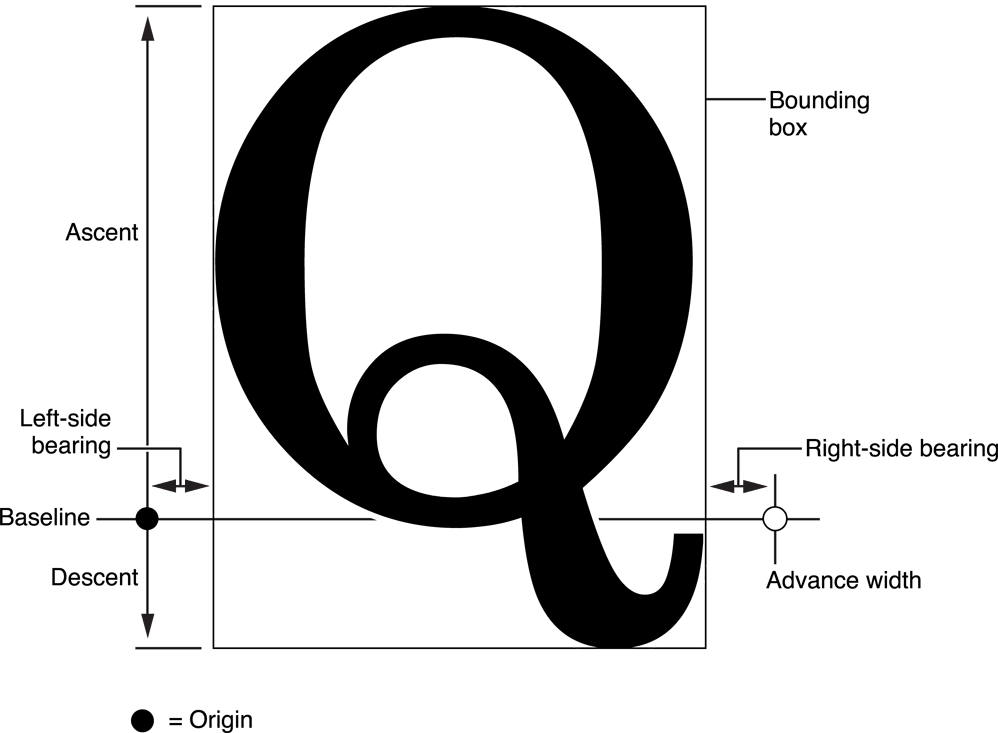

# Typographical Concepts

This chapter defines some important typographical concepts relevant to the text system. Many of the terms representing these concepts are reflected in text system APIs. If you’re familiar with typography, you can skip this chapter.

### Characters and Glyphs

**A character is the smallest unit of written language that carries meaning. Characters can correspond to a particular sound in the spoken form of the language, as do the letters of the roman alphabet; they can represent entire words, such as Chinese ideographs; or they can represent independent concepts, such as mathematical symbols. In every case, [however, a character is an abstract concept]().**

**Although characters must be represented in a display area by a recognizable shape, they are not identical to that shape. That is, a character can be drawn in various forms and remain the same character. For example, an “uppercase A” character can be drawn with a different size or a different stroke thickness, it can lean or be vertical, and it can have certain optional variations in form, such as serifs. [Any one of these various concrete forms of a character is called a glyph](). Figure 2-1 shows different glyphs that all represent the character “uppercase A.”**

**Characters and glyphs do not have a one-to-one correspondence. In some cases a character may be represented by multiple glyphs, such as an “é” which may be an “e” glyph combined with an acute accent glyph “´”. In other cases, a single glyph may represent multiple characters, as in the case of a ligature, or joined letter.** Figure 2-2 shows individual characters and the single-glyph ligature often used when they are adjacent.

A ligature is an example of a contextual form in which the glyph used to represent a character changes depending on the characters next to it. Other contextual forms include alternate glyphs for characters beginning or ending a word.

**Computers store characters as numbers mapped by encoding tables to their corresponding characters.** The encoding scheme native to iOS and OS X conforms to the Unicode standard. Unicode provides a standard methodology for assigning a unique number for every character in every modern written language in the world, independent of the platform, program, and programming language being used. This universal standard solves a longstanding problem of different computer systems using hundreds of conflicting encoding schemes. It also provides information specifying how to handle bidirectional text and contextual forms; how to form words and break lines; how to sort text in different languages; and how to format numbers, dates, times, and other elements appropriate to different languages.

**Glyphs are also represented by numeric codes called glyph codes.** The glyphs used to depict characters are selected by the layout manager during composition and layout processing. The layout manager determines which glyphs to use and where to place them in the display, or view. The layout manager caches the glyph codes in use and provides methods to convert between characters and glyphs and between characters and view coordinates.

### Typefaces and Fonts

**A typeface is a set of visually related shapes for some or all of the characters in a written language. For example, Times is a typeface, designed by Stanley Morrison in 1931 for The Times newspaper of London. All of the letter forms in Times are related in appearance, having consistent proportions between stems (vertical strokes) and counters (rounded shapes in letter bodies) and other elements. When laid out in blocks of text, the shapes in a typeface work together to enhance readability.**

**A typestyle, or simply style, is a distinguishing visual characteristic of a typeface. For example, roman typestyle is characterized by upright letters having serifs and stems thicker than horizontal lines. In italic typestyle, the letters slant to the right and are rounded, similar to cursive or handwritten letter shapes. A typeface usually has several associated typestyles.**

**A font is a series of glyphs depicting the characters in a consistent size, typeface, and typestyle. A font is intended for use in a specific display environment. Fonts contain glyphs for all the contextual forms, such as ligatures, as well as the normal character forms.**

**A font family is a group of fonts that share a typeface but differ in typestyle. So, for example, Times is the name of a font family (as well as the name of its typeface). Times roman and Times Italic are the names of two individual fonts belonging to the Times family. Figure 2-3 shows several of the fonts in the Times font family.**

**Styles, also called traits, include variations such as bold, italic, condensed, expanded, narrow, small caps, poster fonts, and fixed pitch. The text system includes objects called font descriptors, which provide font-matching capability, so that you can partially describe a font by creating a font descriptor with, for example, just a family name or weight, and you can then find all the fonts on the system that match the given trait.**

### Text Layout

Text layout is the process of arranging glyphs on a display device, in an area called a text view, which represents an area similar to a page in traditional typesetting. The order in which glyphs are laid out relative to each other is called text direction. In English and other languages derived from Latin, glyphs are placed side by side to form words that are separated by spaces. Words are laid out in lines beginning at the top left of the text view proceeding from left to right until the text reaches the right side of the view. Text then begins a new line at the left side of the view under the beginning of the previous line, and layout proceeds in the same manner to the bottom of the text view.

In other languages, glyph layout can be quite different. For example, some languages lay out glyphs from right to left or vertically instead of horizontally. It is common, especially in technical writing, to mix languages with differing text direction, such as English and Hebrew, in the same line. Some writing systems even alternate layout direction in every other line (an arrangement called boustrophedonic writing). Some languages do not group glyphs into words separated by spaces. Moreover, some apps call for arbitrary arrangements of glyphs; for example, in a graphic design context, a layout may require glyphs to be arranged on a nonlinear path.

To create lines from a string of glyphs, the layout engine must perform line breaking by finding a point at which to end one line and begin the next. In the text system, you can specify line breaking at either word or glyph boundaries. ***In roman text, a word broken between glyphs requires insertion of a hyphen glyph at the breakpoint.***

The layout manager lays out glyphs along an invisible line called the baseline. In roman text, the baseline is horizontal, and the bottom edge of most of the glyphs rest on it. Some glyphs extend below the baseline, including those for characters like “g” that have descenders, or “tails,” and large rounded characters like “O” that must extend slightly below the baseline to compensate for optical effects. Other writing systems place glyphs below or centered on the baseline. Every glyph includes an origin point that the layout manager uses to align it properly with the baseline.

Glyph designers provide a set of measurements with a font, called metrics, which describe the spacing around each glyph in the font. The layout manager uses these metrics to determining glyph placement. In horizontal text, the glyph has a metric called the advance width, which measures the distance along the baseline to the origin point of the next glyph. Typically there is some space between the origin point and the left side of the glyph, which is called the left-side bearing. There may also be space between the right side of the glyph and the point described by the advance width, which is called the right-side bearing. The vertical dimension of the glyph is provided by two metrics called the ascent and the descent. **The ascent is the distance from the origin (on the baseline) to the top of the tallest glyphs in the font. The descent, which is the distance below the baseline to the bottom of the font’s deepest descender.** The rectangle enclosing the visible parts of the glyph is called the bounding rectangle or bounding box. Figure 2-4 illustrates these metrics.

By default, in horizontal text, typesetters place glyphs side-by-side using the advance width, resulting in a standard interglyph space. However, in some combinations, text is made more readable by kerning, which is shrinking or stretching the space between two glyphs. A very common example of kerning occurs between an uppercase W and uppercase A, as shown in Figure 2-5. Type designers include kerning information in the metrics for a font. The text system provides methods to turn kerning off, use the default settings provided with the font, or tighten or loosen the kerning throughout a selection of text.

Type systems usually measure font metrics in units called points, which measure exactly 72 per inch in most computer typesetting systems. Adding the distance of the ascent and the descent of a font provides the font’s point size.

Space added during typesetting between lines of type is called leading, after the slugs of lead used for that purpose in traditional metal-type page layout. The total amount of ascent plus descent plus leading provides a font’s line height. **(Leading is sometimes also called linegap. It is often specified as a ratio of a font’s point size over the line height at which a block of text is set, such as 14/16.5.)**

Although the preceding typographic concepts of type design may be somewhat esoteric, most people who have created documents on a computer or typewriter are familiar with the elements of text layout on a page. For example, **the margins are the areas of white space between the edges of the page and the text area where the layout engine places glyphs. Alignment describes the way text lines are placed relative to the margins.** For example, horizontal text can be aligned right, left, or centered, as shown in Figure 2-6.

Lines of text can also be justified; for horizontal text the lines are aligned on both right and left margin by varying interword and interglyph spacing, as shown in Figure 2-7. The system performs alignment and justification, if requested, after the text stream has been broken into lines and hyphens added and other glyph substitutions made.

