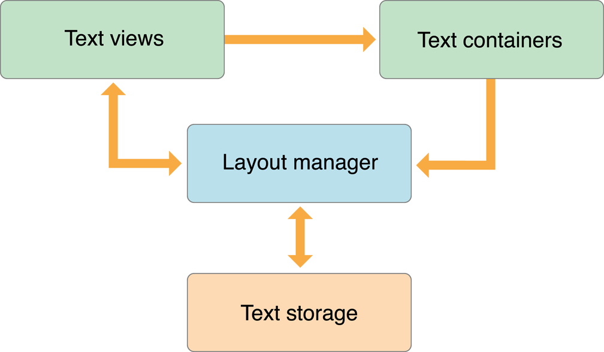
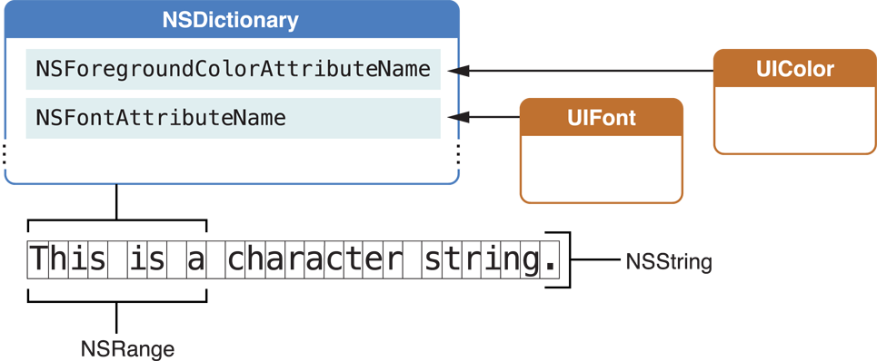
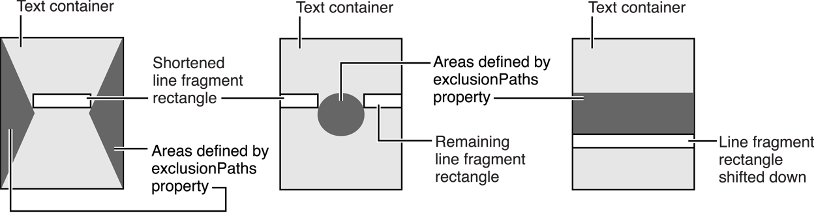
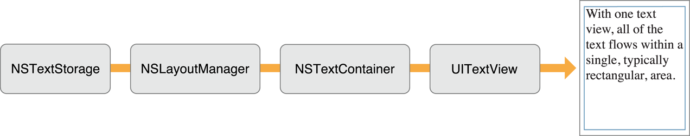
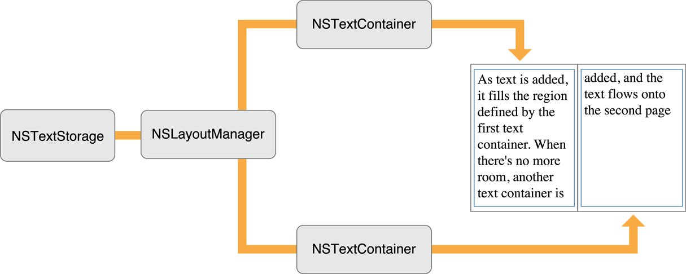
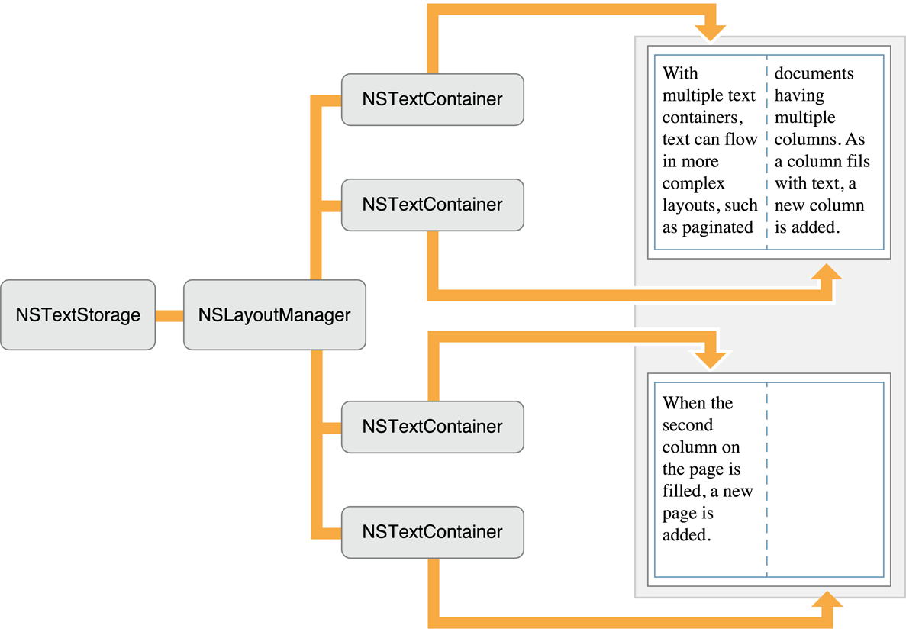
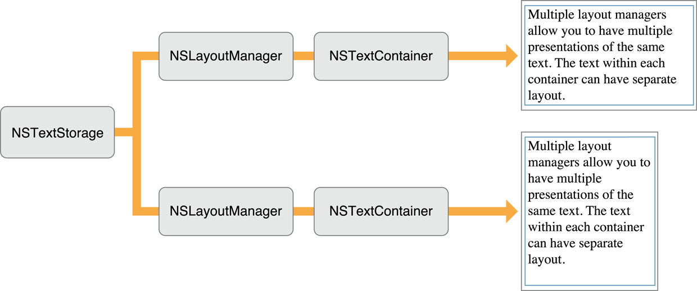

# Using Text Kit to Draw and Manage Text

The UIKit framework includes several classes whose purpose is to display text in an app’s user interface: UITextView, UITextField, and UILabel, as described in Displaying Text Content in iOS. Text views, created from the UITextView class, are meant to display large amounts of text. Underlying UITextView is a powerful layout engine called Text Kit. If you need to customize the layout process or you need to intervene in that behavior, you can use Text Kit. For smaller amounts of text and special needs requiring custom solutions, you can use alternative, lower-level technologies, as described in Lower Level Text-Handling Technologies.

Text Kit is a set of classes and protocols in the UIKit framework providing high-quality typographical services that enable apps to store, lay out, and display text with all the characteristics of fine typesetting, such as kerning, ligatures, line breaking, and justification. Text Kit is built on top of Core Text, so it provides the same speed and power. UITextView is fully integrated with Text Kit; it provides editing and display capabilities that enable users to input text, specify formatting attributes, and view the results. The other Text Kit classes provide text storage and layout capabilities. Figure 8-1 shows the position of Text Kit among other iOS text and graphics frameworks.


Text Kit gives you complete control over text rendering in user interface elements. In addition to UITextView, UITextField and UILabel are built on top of Text Kit, and it seamlessly integrates with animations, UICollectionView and UITableView. Text Kit is designed with a fully extensible object-oriented architecture that supports subclassing, delegation, and a thorough set of notifications enabling deep customization.

### Primary Text Kit Objects

The data flow paths among the primary Text Kit objects are shown in Figure 8-2. Text views are instances of UITextView class, text containers are instances of NSTextContainer class, the layout manager is an instance of NSLayoutManager class, and the text storage is an instance of NSTextStorage class. **In Text Kit, an NSTextStorage object stores the text that is displayed by a UITextView object and laid out by an NSLayoutManager object into an area defined by NSTextContainer object.**



**An NSTextContainer object defines a region where text can be laid out. Typically, a text container defines a rectangular area, but by creating a subclass of NSTextContainer you can create other shapes: circles, pentagons, or irregular shapes, for example. Not only does a text container describe the outline of an area that can be filled with text, it maintains an array of Bezier paths that are exclusion zones within its area where text is not laid out. As it is laid out, text flows around the exclusion paths, providing a means to include graphics and other non-text layout elements.**

**NSTextStorage defines the fundamental storage mechanism of the Text Kit’s extended text-handling system. NSTextStorage is a subclass of NSMutableAttributedString that stores the characters and attributes manipulated by the text system. It ensures that text and attributes are maintained in a consistent state across editing operations. In addition to storing the text, an NSTextStorage object manages a set of client NSLayoutManager objects, notifying them of any changes to its characters or attributes so that they can relay and redisplay the text as needed.**

**An NSLayoutManager object orchestrates the operation of the other text handling objects. It intercedes in operations that convert the data in an NSTextStorage object to rendered text in a view’s display area. It maps Unicode character codes to glyphs and oversees the layout of the glyphs within the areas defined by NSTextContainer objects.**

> Note: NLayoutManager, NSTextStorage, and NSTextContainer can be accessed from subthreads as long as the app guarantees the access from a single thread.

For reference information about UITextView, see UITextView Class Reference. NSTextContainer is described in NSTextContainer Class Reference for iOS, NSLayoutManager in NSLayoutManager Class Reference for iOS, and NSTextStorage in NSTextStorage Class Reference for iOS.

### Text Attributes

Text Kit handles three kinds of text attributes: character attributes, paragraph attributes, and document attributes. Character attributes include traits such as font, color, and subscript, which can be associated with an individual character or a range of characters. Paragraph attributes are traits such as indentation, tabs, and line spacing. Document attributes include documentwide traits such as paper size, margins, and view zoom percentage.

##### Character Attributes

An attributed string stores character attributes as key-value pairs in NSDictionary objects. The key is an attribute name, represented by an identifier (an NSString constant) such as NSFontAttributeName. Figure 8-3 shows an attributed string with an attribute dictionary applied to a range within the string.



Conceptually, each character in an attributed string has an associated dictionary of attributes. Typically, however, an attribute dictionary applies to a longer range of characters, a run of text. The NSAttributedString class provides methods that take a character index and return the associated attribute dictionary and the range to which its attribute values apply, such as attributesAtIndex:effectiveRange:.

You can assign any attribute key-value pair you choose to a range of characters, in addition to working with predefined attributes. You add the attributes to the appropriate character range in the NSTextStorage object using the NSMutableAttributedString method addAttribute:value:range:. You can also create an NSDictionary object containing the names and values of a set of custom attributes and add them to the character range in a single step using the addAttributes:range: method. **To make use of your custom attributes, you need a custom subclass of NSLayoutManager to work with them. Your subclass should override the drawGlyphsForGlyphRange:atPoint: method. Your override can first call the superclass to draw the glyph range and then draw your own attributes on top. Alternatively, your override can draw the glyphs entirely your own way.**

##### Paragraph Attributes

Paragraph attributes affect the way the layout manager arranges lines of text into paragraphs on a page. The text system encapsulates paragraph attributes in objects of the NSParagraphStyle class. The value of one of the predefined character attributes, NSParagraphStyleAttributeName, points to an NSParagraphStyle object containing the paragraph attributes for that character range. Attribute fixing ensures that only one NSParagraphStyle object pertains to the characters throughout each paragraph.

Paragraph attributes include traits such as alignment, tab stops, line-breaking mode, and line spacing (also known as leading).

##### Document Attributes

Document attributes pertain to a document as a whole. Document attributes include traits such as paper size, margins, and view zoom percentage. Although the text system has no built-in mechanism to store document attributes, NSAttributedString initialization methods such as initWithRTF:documentAttributes: can populate an NSDictionary object that you provide with document attributes derived from a stream of RTF or HTML data. Conversely, methods that write RTF data, such as RTFFromRange:documentAttributes:, write document attributes if you pass a reference to an NSDictionary object containing them with the message.

##### Attribute Fixing

Editing attributed strings can cause inconsistencies that must be cleaned up by attribute fixing. The UIKit extensions to NSMutableAttributedString define the fixAttributesInRange: method to fix inconsistencies among attachment, character, and paragraph attributes. These methods ensure that attachments don’t remain after their attachment characters are deleted, that character attributes apply only to characters available in that font, and that paragraph attributes are consistent throughout paragraphs.

 
### Changing Text Storage Programmatically

An NSTextStorage object serves as the character data repository for Text Kit. The format for this data is an attributed string, which is a sequence of characters (in Unicode encoding) and associated attributes (such as font, color, and paragraph style). The classes that represent attributed strings are NSAttributedString and NSMutableAttributedString, of which NSTextStorage is a subclass. As described in Character Attributes, each character in a block of text has a dictionary of keys and values associated with it. A key names an attribute (such as NSFontAttributeName), and the associated value specifies the characteristics of that attribute (such as Helvetica 12-point).

There are three stages to editing a text storage object programmatically. The first stage is to send it a beginEditing message to announce a group of changes.

In the second stage, you send it some editing messages, such as replaceCharactersInRange:withString: and setAttributes:range:, to effect the changes in characters or attributes. Each time you send such a message, the text storage object invokes edited:range:changeInLength: to track the range of its characters affected since it received the beginEditing message.

In the third stage, when you’re done changing the text storage object, you send it an endEditing message. This causes it to sends out the delegate message textStorage:willProcessEditing:range:changeInLength: and invoke its own processEditing method, fixing attributes within the recorded range of changed characters. See Attribute Fixing for information about attribute fixing.

After fixing its attributes, the text storage object sends the delegate method textStorage:didProcessEditing:range:changeInLength:, giving the delegate an opportunity to verify and possibly change the attributes. (Although the delegate can change the text storage object’s character attributes in this method, it cannot change the characters themselves without leaving the text storage in an inconsistent state.) Finally, the text storage object sends the processEditingForTextStorage:edited:range:changeInLength:invalidatedRange: message to each associated layout manager—indicating the range in the text storage object that has changed, along with the nature of those changes. The layout managers in turn use this information to recalculate their glyph locations and redisplay if necessary.

### Working with Font Objects

A computer font is a data file in a format such as OpenType or TrueType, containing information describing a set of glyphs, as described in Characters and Glyphs, and various supplementary information used in glyph rendering. The UIFont class provides the interface for getting and setting font information. A UIFont instance provides access to the font’s characteristics and glyphs. Text Kit combines character information with font information to choose the glyphs used during text layout. You use font objects by passing them to methods that accept them as a parameter. Font objects are immutable, so it is safe to use them from multiple threads in your app.

You don’t create UIFont objects using the alloc and init methods; instead, you use preferredFontForTextStyle: with a text style constant or fontWithName:size:. You can also use a font descriptor to create a font with fontWithDescriptor:size:. These methods check for an existing font object with the specified characteristics, returning it if there is one. Otherwise, they look up the font data requested and create the appropriate font object.

##### Text Styles

Text styles, introduced in iOS 7, are semantic descriptions of the intended uses for fonts and are implemented by a mechanism known as Dynamic Type. Text styles are organized by use and represented by constants defined in UIFontDescriptor.h, as shown in Table 8-1. The actual font used for the purpose described by a text style can vary based on a number of dynamic considerations, including the user’s content size category preference, which is represented by the UIApplication property preferredContentSizeCategory. To acquire a font object for a given text style, you pass the corresponding constant to the UIFont method preferredFontForTextStyle:. To acquire a font descriptor for a text style, pass the constant to the UIFontDescriptor method preferredFontDescriptorWithTextStyle:. (See Using Font Descriptors for more information about font descriptors.)

Table 8-1  Text style constants

|Constant|Usage|
|---|---|
|UIFontTextStyleHeadline|The font used for headings.|
|UIFontTextStyleSubheadline|The font used for subheads.|
|UIFontTextStyleBody|The font used for body text.|
|UIFontTextStyleFootnote|The font used for footnotes.|
|UIFontTextStyleCaption1|The font used for standard captions.|
|UIFontTextStyleCaption2|The font used for alternate captions.|

Text styles bring many advantages to apps through the Dynamic Type mechanism, all of which enhance the readability of your text. Dynamic Type responds in a coordinated way to user preferences and responds to accessibility settings for enhanced legibility and oversize type. That is, when you call preferredFontForTextStyle:, the specific font returned includes traits which vary according to user preferences and context, including tracking (letter-spacing) adjustments, in addition to being tuned for the use specified by the particular text style constant.

The fonts returned using text style constants are meant to be used for all text in an app other than text in user interface elements, such as buttons, bars, and labels. Naturally, you need to choose text styles that look right in your app. It’s also important to observe the UIContentSizeCategoryDidChangeNotification so that you can re–lay out the text when the user changes the content size category. When your app receives that notification, it should send the invalidateIntrinsicContentSize message to views positioned by Auto Layout or send setNeedsLayout to user interface elements positioned manually. And it should invalidate preferred fonts or font descriptors and acquire new ones as needed.

##### Using Font Descriptors

Font descriptors, instantiated from the UIFontDescriptor class, provide a way to describe a font with a dictionary of attributes and are used to create UIFont objects. In particular, you can make a UIFont object from a font descriptor, you can get a descriptor from a UIFont object, and you can change a descriptor and use it to make a new font object. You can also use a font descriptor to specify custom fonts provided by an app.

Font descriptors can be archived, which is an advantage working with text styles. You should not cache font objects specified by text styles because they are dynamic—their characteristics vary over time according to user preferences. But you can cache a font descriptor to preserve a description of a font, and then unarchive it later and use it to create a font object with the same characteristics.

You can use font descriptors to query the system for available fonts that match particular attributes, and then create instances of fonts matching those attributes, such as names, traits, languages, and other features. For example, you can use a font descriptor to retrieve all the fonts matching a given font family name, using the family names defined by the CSS standard, as shown in Listing 8-1.

Listing 8-1  Font family name matching


```
UIFontDescriptor *helveticaNeueFamily =
    [UIFontDescriptor fontDescriptorWithFontAttributes:
        @{ UIFontDescriptorFamilyAttribute: @"Helvetica Neue" }];
NSArray *matches =
    [helveticaNeueFamily matchingFontDescriptorsWithMandatoryKeys: nil];
```

The matchingFontDescriptorsWithMandatoryKeys: method as shown returns an array of font descriptors for all the Helvetica Neue fonts on the system, such as HelveticaNeue, HelveticaNeue-Medium, HelveticaNeue-Light, HelveticaNeue-Thin, and so on.

You can modify the fonts returned by preferredFontForTextStyle: by applying symbolic traits, such as bold, italic, expanded, and condensed. You can use font descriptors to modify particular traits, as shown in Listing 8-2.

```
UIFontDescriptor *fontDescriptor =
    [UIFontDescriptor preferredFontDescriptorWithTextStyle: UIFontTextStyleBody];
UIFontDescriptor *boldFontDescriptor =
    [fontDescriptor fontDescriptorWithSymbolicTraits: UIFontDescriptorTraitBold];
UIFont *boldFont = [UIFont fontWithDescriptor: boldFontDescriptor size: 0.0];
```

This code snippet first retrieves a font descriptor for the body text style, then modifies that font descriptor to specify the bold trait, and finally uses the UIFont class method fontWithDescriptor:size: to return an actual font object for the body text style with a bold trait. **Passing a size value of 0.0 with fontWithDescriptor:size: specifies that the size attribute originally returned with the font descriptor is preserved. This behavior is desired, of course, because the font size is determined by the dynamic type mechanism.**

###### Activating Font Features

Another important use for font descriptors is to activate and select among font features. Font features are typographic attributes of a font that control aspects of its appearance when its glyphs are rendered by the text system. Font features are available for a font only if the font designer chooses to include them. Some font features are available in few fonts, while others are common to many fonts. In addition, different versions of the same font, installed on different platforms, can vary in their available font features.

Font features are grouped into categories called feature types, within which individual feature selectors choose particular feature settings. Feature types can be exclusive or nonexclusive. If a feature type is exclusive you can choose only one of the available feature selectors at a time, such as whether numbers are to be proportional or fixed-width. If a feature type is nonexclusive, you can enable any number of feature selectors at once. For example, for the ligature feature type you can choose any combination of the available classes of ligatures that the font supports.

>  If you select features that are not available in a font, you won’t see a change in the appearance of the font’s glyphs.

Some features are contextual while others are noncontextual. The manner in which contextual features are applied to a glyph depends on the glyph’s position compared to adjacent glyphs. One of the powerful aspects of the text system’s layout capability is its ability to apply sophisticated contextual processing automatically.

Noncontextual features are applied in the same manner to a glyph regardless of the adjacent glyphs. These features include the selection of alternate glyph sets to give text a different appearance and glyph substitution for purposes of mathematical typesetting or enhancing typographic sophistication.

For example, the code in Listing 8-3 activates two feature types defined by the Helvetica Neue Medium font.

Listing 8-3  Activating Font Features

```
NSArray *timeFeatureSettings = @[
  @{
    UIFontFeatureTypeIdentifierKey: @(kNumberSpacingType),
    UIFontFeatureSelectorIdentifierKey: @(kProportionalNumbersSelector)
  },
  @{
    UIFontFeatureTypeIdentifierKey: @(kCharacterAlternativesType),
    UIFontFeatureSelectorIdentifierKey: @(2)
  }];
 
UIFont *originalFont = [NSFont fontWithName: @"HelveticaNeue-Medium" size: 12.0];
UIFontDescriptor *originalDescriptor = [originalFont fontDescriptor];
UIFontDescriptor *timeDescriptor = [originalDescriptor
    fontDescriptorByAddingAttributes: @{
        UIFontDescriptorFeatureSettingsAttribute: timeFeatureSettings }];
UIFont *timeFont = [UIFont fontWithDescriptor: timeDescriptor size: 12.0];
```

The code in Listing 8-3 activates the number spacing feature type (represented by the constant kNumberSpacingType), selecting proportional-width numerals (kProportionalNumbersSelector), and the character alternatives feature type (kCharacterAlternativesType), with the feature selector identifier key value of 2. The constants used in this example to represent font feature types and selectors are declared as enumerations in the header file SFNTLayoutTypes.h in the Core Text framework (CoreText/CoreText.h). In the case of the character alternatives type, there are no predefined constants to represent the feature selector identifiers, so you simply use the font-defined numeric value.

Because font features are defined by the font, the most reliable way to determine supported features is to query the font directly. You can do this using the CTFontCopyFeatures function in Core Text, as shown in Listing 8-4.

Listing 8-4  Querying Font Features

```
UIFont *font = [UIFont fontWithName: @"HelveticaNeue-Medium" size: 12.0];
CFArrayRef fontFeatures = CTFontCopyFeatures((__bridge CTFontRef) font);
NSLog(@"properties = %@", fontFeatures);
```

Listing 8-5 shows an array of font features resulting from the CTFontCopyFeatures function in Listing 8-4, as it is displayed on the console log.

Listing 8-5  Typical Result from CTFontCopyFeatures Function

```
properties = (
        {
        CTFeatureTypeExclusive = 1;
        CTFeatureTypeIdentifier = 6;
        CTFeatureTypeName = "Number Spacing";
        CTFeatureTypeNameID = 266;
        CTFeatureTypeSelectors =         (
                        {
                CTFeatureSelectorDefault = 1;
                CTFeatureSelectorIdentifier = 0;
                CTFeatureSelectorName = "No Change";
                CTFeatureSelectorNameID = 264;
            },
                        {
                CTFeatureSelectorIdentifier = 1;
                CTFeatureSelectorName = "Proportional Numbers";
                CTFeatureSelectorNameID = 267;
            }
        );
    },
        {
        CTFeatureTypeExclusive = 1;
        CTFeatureTypeIdentifier = 17;
        CTFeatureTypeName = "Character Alternatives";
        CTFeatureTypeNameID = 262;
        CTFeatureTypeSelectors =         (
                        {
                CTFeatureSelectorDefault = 1;
                CTFeatureSelectorIdentifier = 0;
                CTFeatureSelectorName = "No Change";
                CTFeatureSelectorNameID = 264;
            },
                        {
                CTFeatureSelectorIdentifier = 1;
                CTFeatureSelectorName = "Alternate Punctuation";
                CTFeatureSelectorNameID = 263;
            },
                        {
                CTFeatureSelectorIdentifier = 2;
                CTFeatureSelectorName = "Numbers Punctuation";
                CTFeatureSelectorNameID = 265;
            }
        );
    }
)
```

In this case, the result shows that this version of the Helvetica Neue Medium font has two font features: Number Spacing and Character Alternatives. When you use font descriptors to activate font features and select among their settings, the most important values in this result are the feature type identifiers and feature selector identifiers. You add these values to an array of dictionaries representing the font feature settings, and you use that array as the value of UIFontDescriptorFeatureSettingsAttribute, passed in turn to the fontDescriptorByAddingAttributes: or fontDescriptorWithFontAttributes: methods, as shown in Listing 8-3. The enumerated values of the constants shown in that listing correlate with the numeric values of the feature type identifiers and feature selector identifiers returned by the CTFontCopyFeatures function.

As shown in Listing 8-5, the array of font features resulting from the CTFontCopyFeatures function also shows whether a feature type is exclusive or not and which feature selector is the default. And, of course, the feature type name and feature selector name values provide human-readable identification for the available font features and their settings.

##### Querying Font Metrics

UIFont defines a number of methods for accessing a font’s metrics information, when that information is available. Properties such as ascender, capHeight, xHeight, and so on, all correspond to standard font metrics information. Figure 8-4 shows how the font metrics apply to glyph dimensions, and Table 8-2 lists property names that correlate with various metrics. See the property descriptions for more specific information.


Table 8-2  Font metrics and related UIFont methods

|Font metric|Properties|
|---|---|
|X-height|xHeight|
|Ascent|ascender|
|Cap height|capHeight|
|Line height|lineHeight|
|Descent|descender|
|Point size|pointSize|

### Laying Out Text

The layout manager object, instantiated from the NSLayoutManager class, is the central controlling object for text display in Text Kit. The layout manager performs the following actions:

- Controls text storage and text container objects
- Generates glyphs from characters
- Computes glyph locations and stores the information
- Manages ranges of glyphs and characters
- Draws glyphs in text views when requested by the view
- Computes bounding box rectangles for lines of text
- Controls hyphenation
- Manipulates character attributes and glyph properties

In the model-view-controller paradigm, the layout manager is the controller. NSTextStorage, a subclass of NSMutableAttributedString, provides part of the model, holding a string of text characters with attributes such as typeface, style, color, and size. NSTextContainer can also be considered part of the model because it models the geometric layout of the page on which the text is laid out. UITextView (or another UIView object) provides the view in which the text is displayed. NSLayoutManager serves as the controller for the text system because it translates characters in the text storage object into glyphs, lays them out in lines according to the dimensions of one or more text container objects, and coordinates the text display in one or more text view objects.

##### The Layout Process

**The layout manager performs text layout in two separate steps: glyph generation and glyph layout.** The layout manager performs both layout steps lazily, that is, on an as-needed basis. Accordingly, some NSLayoutManager methods cause glyph generation to happen, while others do not, and the same is true with glyph layout. After it generates glyphs and after it calculates their layout locations, the layout manager caches the information to improve performance of subsequent invocations.

The layout manager caches glyphs, attributes, and layout information. It keeps track of ranges of glyphs that have been invalidated by changes to the characters in the text storage. There are two ways in which a character range can be automatically invalidated: if it needs glyphs generated or if it needs glyphs laid out. If you prefer, you can manually invalidate either glyph or layout information. When the layout manager receives a message requiring knowledge of glyphs or layout in an invalidated range, it generates the glyphs or recalculates the layout as necessary.

##### Generating Line Fragment Rectangles

**The layout manager lays text within an NSTextContainer object in lines of glyphs. **The layout of these lines within the text container is determined by its shape and by any exclusion paths it contains. Wherever the line fragment rectangle intersects a region defined by an exclusion path, the lines in those parts must be shortened or fragmented; if there’s a gap across the entire region, the lines that would overlap it have to be shifted to compensate.

The layout manager proposes a rectangle for a given line and then asks the text container to adjust the rectangle to fit. The proposed rectangle usually spans the text container’s bounding rectangle, but it can be narrower or wider, and it can also lie partially or completely outside the bounding rectangle. The message that the layout manager sends the text container to adjust the proposed rectangle is lineFragmentRectForProposedRect:atIndex:writingDirection:remainingRect:, which returns the largest rectangle available for the proposed rectangle, based on the direction in which text is laid out. It also returns a rectangle containing any remaining space, such as the space left on the other side of a hole or gap in the text container.

The layout manager makes one final adjustment when it actually fits text into the rectangle. This adjustment is a small amount fixed by the text container, called the line fragment padding, which defines the portion on each end of the line fragment rectangle left blank. Text is inset within the line fragment rectangle by this amount (the rectangle itself is unaffected). Padding allows for small-scale adjustment of the text container’s region at the edges (and around any holes) and keeps text from directly abutting any other graphics displayed near the region. You can change the padding from its default value with the lineFragmentPadding property. Note that line fragment padding isn’t a suitable means for expressing margins. For document margins, you should set the UITextView object’s position and size within its enclosing view. And for text margins, you should set the textContainerInset property of the text view. In addition, you can set indentation values for individual paragraphs using NSMutableParagraphStyle properties such as headIndent.

In addition to returning the line fragment rectangle itself, the layout manager returns a rectangle called the used rectangle. This is the portion of the line fragment rectangle that actually contains glyphs or other marks to be drawn. By convention, both rectangles include the line fragment padding and the interline space (which is calculated from the font’s line height metrics and the paragraph’s line spacing parameters). However, the paragraph spacing (before and after) and any space added around the text, such as that caused by center-spaced text, are included only in the line fragment rectangle, and are not included in the used rectangle.

##### Specifying Exclusion Paths

The text container maintains an array of UIBezierPath objects representing the exclusion paths inside the receiver's bounding rectangle. When the layout manager sends the text container a lineFragmentRectForProposedRect:atIndex:writingDirection:remainingRect: message proposing a line fragment rectangle intersecting one of the regions defined by the exclusion paths, the text container returns an adjusted line fragment rectangle excluding that region. This process is illustrated in Figure 8-6.



##### Specifying Multipage and Multicolumn Layouts 

In the simplest case, the Text Kit objects are configured singly, that is, one text storage object, one text container, and one layout manager, as shown in Figure 8-6. This configuration is instantiated automatically when you drag a text view from the object library in Interface Builder. The UITextView object vends the other objects and connects them together. You can also create this arrangement in code, as shown in Listing 8-6.



You can also create this arrangement in code, as shown in Listing 8-6. This code could be in a view controller, for example, a subclass of UIViewController, that has an NSTextContainer property named textContainer.

Listing 8-6  Object creation for a single text flow

```
NSTextStorage* textStorage = [[NSTextStorage alloc] initWithString:string];
NSLayoutManager *layoutManager = [[NSLayoutManager alloc] init];
[textStorage addLayoutManager:layoutManager];
self.textContainer = [[NSTextContainer alloc] initWithSize:self.view.bounds.size];
[layoutManager addTextContainer:self.textContainer];
UITextView* textView = [[UITextView alloc] initWithFrame:self.view.bounds textContainer:self.textContainer];
[self.view addSubview:textView];
```

By using multiple text containers, each with an associated text view, more complex layout arrangements are possible. For example, to support page breaks, an app can configure the text objects as shown in Figure 8-7.



Each text container corresponds to a page of the document. The views displaying the text can be embedded in a custom view object that your app provides as a background for the text views. This custom view, in turn, can be embedded in a UIScrollView object to enable the user to scroll through the document’s pages.

A multicolumn document can be modeled with a similar arrangement of objects, as shown in Figure 8-8.



Instead of having one text container correspond to a single page, there are now two text containers—one for each column on the page. Each text container controls a portion of the document. As the text is displayed, glyphs are first laid out in the top-left container. When there is no more room in that view, the layout manager informs its delegate that it has finished filling the container. The delegate can check to see whether there’s more text that needs to be laid out and add another text container if necessary. The layout manager proceeds to lay out text in the next container, notifies the delegate when finished, and so on. Again, a custom view (depicted as a blue rectangle) provides a canvas for these text columns.

Not only can you have multiple text containers, you can also have multiple NSLayoutManager objects accessing the same text storage. Figure 8-9 illustrates an object arrangement with multiple layout managers. The effect of this arrangement is to provide multiple views of the same text. If the user alters the text in the top view, the change is immediately reflected in the bottom view (assuming the location of the change is within the bottom view’s bounds).




