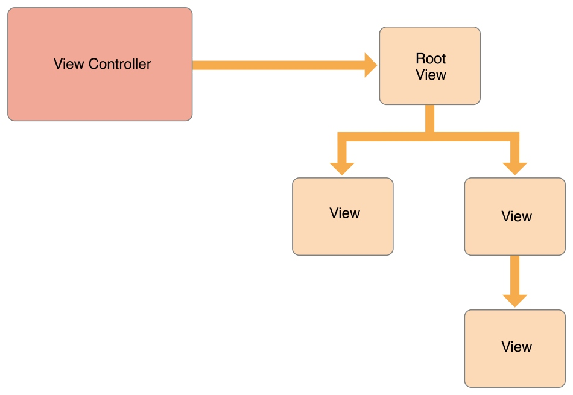
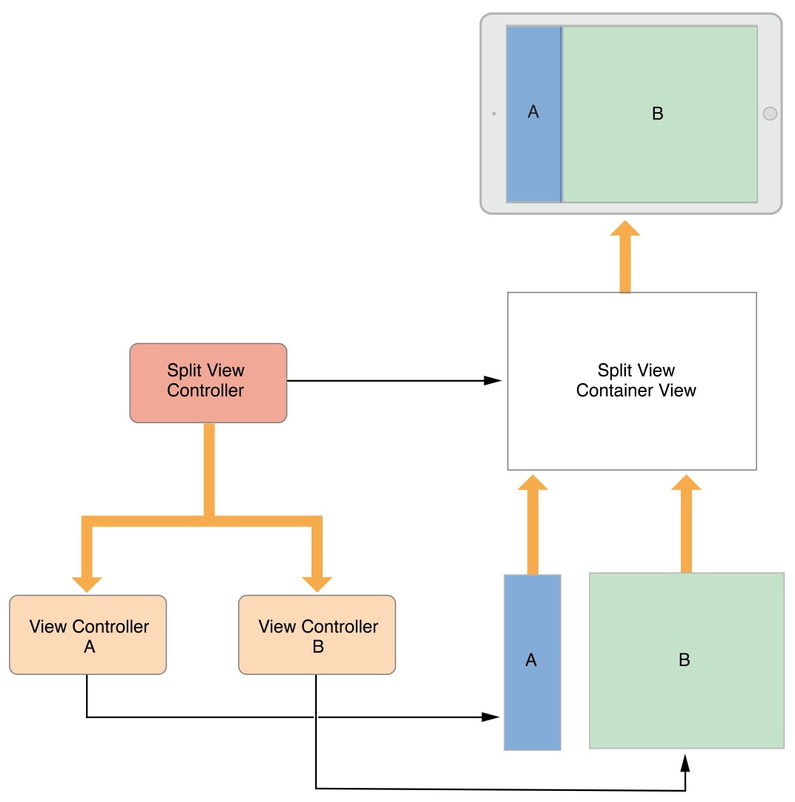
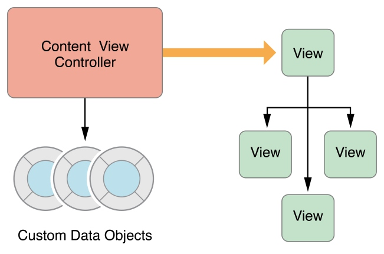
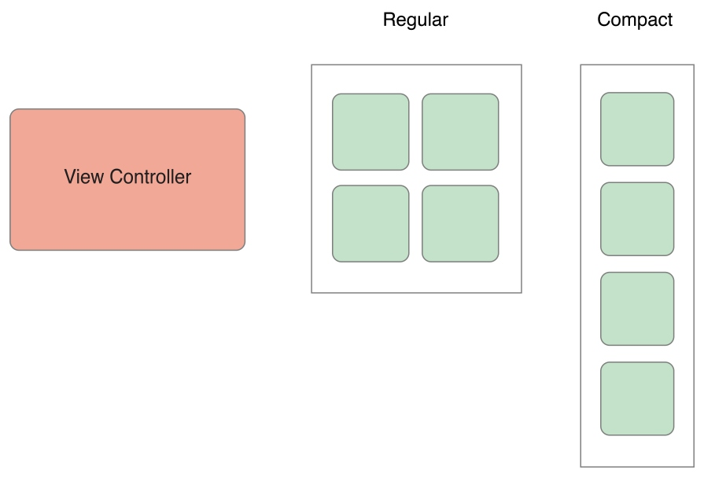
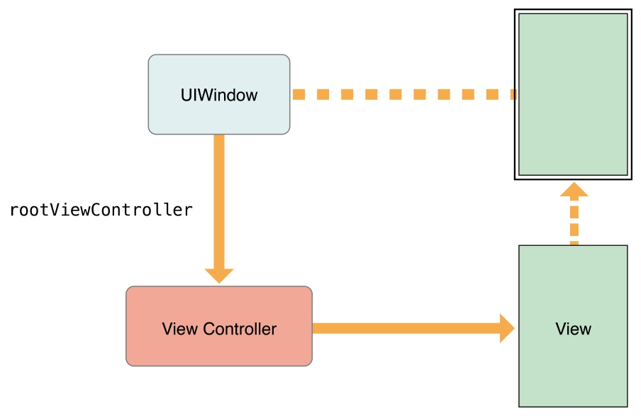
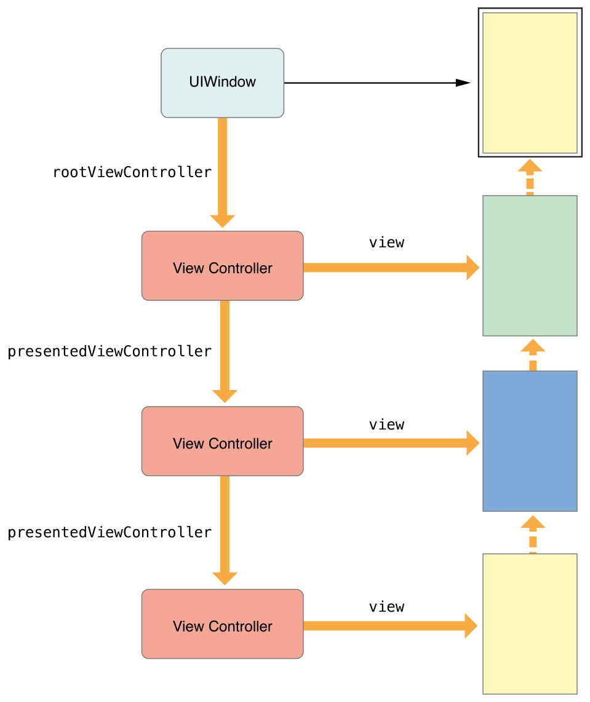
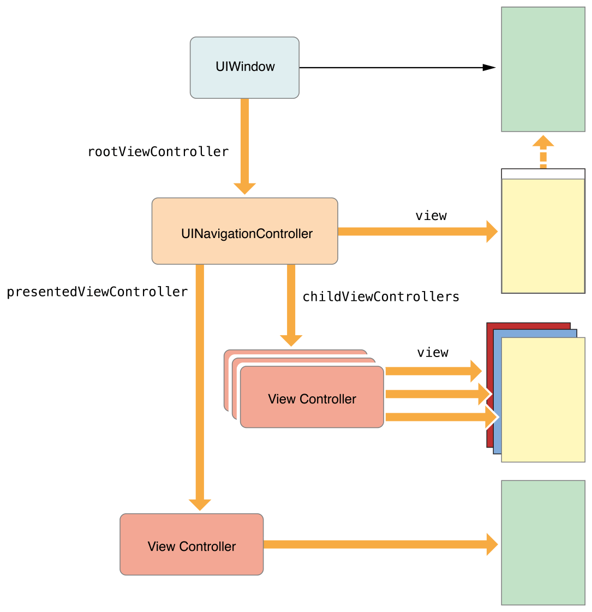

[View Controller Programming Guide for iOS 官方文档传送门](https://developer.apple.com/library/ios/featuredarticles/ViewControllerPGforiPhoneOS/index.html#//apple_ref/doc/uid/TP40007457)
本文翻译自2015-09-16版的官档。
您可以在官档结尾的Document Revision History中查阅版本。
注：【】包含的部分引自原文。

--------

## 概述
### View Controllers的角色
View controllers 是你的App的内部结构的基础。每个App至少拥有一个View Controller，大多数App拥有多个。每个View controller管理你的App的一部分界面（user interface），以及界面和底层数据（underlying data）之间的交互。View Controller还能让你的界面间过渡更加容易。

由于View Controller在你的App中扮演如此重要的角色，因此它是你所有开发工作的中心。UIViewController类定义了方法和属性来管理你的view、处理事件、协助view controller间的过渡，并协调与程序其他部分的配合。你可以生成UIViewController的子类（或子类的子类），并添加需要的代码，来实现你的App的行为。

有两种类型的view controllers:

- 内容 view controllers【Content view controller】管理着你的App的一块独立的内容，这也是你最常创建的view controllers类型。
- 容器 view controllers【Container view controllers】从其他的view controllers（一般被称作child view controllers）中收集信息，以一种更易于导航的方式或以一种不同的展现方式来展现那些view controllers的内容【and present it in a way that facilitates navigation or presents the content of those view controllers differently】。
大多数的Apps是由这两种view controllers组合而成的。

#### 管理View
view controller最重要的角色就是管理一个View树【a hierarchy of views】。每个view controller都有一个根view【root view】，根view包含【encloses】了这个view controller的所有内容。你可以把需要的view添加到根view上来展示你的内容。图1-1展示了view controller 和它的views的内建【build-in】的关系。view controller总是拥有它的根view的一个引用，每个view都拥有它的子views【subviews】的强引用【strong reference】。

图1-1 view controller 和它的views的关系

> **注意**：
使用outlets来访问你的view controller的view树中的其他views是个很常见的实践。view controller管理它所有views的内容，outlets让你持有需要的views的引用。当你的views从storyboard中加载后，outlets会自动的连接到实际的view对象。

内容view controller管理它自己所有的views。而容器view controller管理它自己的views以及它的子view controllers【child view controllers】的views。容器并不会管理它的孩子们的内容，它仅仅管理孩子们的根views，根据容器的设计调整根views的尺寸和位置。图1-2展示了split view controller和它的孩子们的关系。split view controller 管理着子views的尺寸和位置，而子view controller管理那些views的实际内容。

图 1-2 View controllers能管理来自其他view controllers的内容【View controllers can manage content from other view controllers. *这句话是不是有问题？】。

关于如何管理你的view controllers的views，请参考后文的管理View布局【Managing View Layout.】一节。

#### 数据调度（Marshaling）
view controller 在它的views和App的数据之间扮演着中间人的角色。UIViewController类的方法和属性让你可以管理App的可视化展现。当你子类化UIViewController时，你会向子类中添加需要的变量【variables】来管理你的数据。添加自定义的变量创建了图1-3中的关系，view controller持有着你的数据的引用，也持有着展示这些数据的views的引用。在两者之间移动数据是你的职责。

图1-3 view controller 协调【mediates】数据对象【data objects】和views

对于view controllers和数据对象，你应该始终保持清晰的责任划分。大多数确保数据结构完整性的逻辑属于数据对象的职责。view controller可能验证views收集的输入数据，并且将数据打包成数据对象需要的格式，但你应该最小化view controller管理实际数据的职责。

使用UIDocument类是将管理数据从view controller中分离出来一种方式。document对象是一种知道如何从持久化存储中读写数据的对象。当你子类化UIDocument时，你添加需要的逻辑和方法来抽取数据，并将数据传递给view controller或App的其它部分。view controller可能会存储一份数据的拷贝来更加容易的更新views，但document依然拥有真正的数据。

#### 用户交互
view controllers是响应者对象（responder objects），能够处理来自响应链的事件。尽管view controllers有处理触摸事件的能力，但它们几乎不会去处理。而一般是views来处理它们自己的触摸事件，并将结果报告给绑定的delegate或target对象的特定方法。这些delegte或target对象，通常就是view controllers。因此view controller中的通常在delegate方法或action方法中处理事件。
更多的关于在你的view controller中实现action方法的信息，请参考后文中的“处理用户交互”。更多的关于处理其他类型事件的信息，参考[事件处理指南官方文档【Event Handling Guide for iOS】](https://developer.apple.com/library/ios/documentation/EventHandling/Conceptual/EventHandlingiPhoneOS/Introduction/Introduction.html#//apple_ref/doc/uid/TP40009541)。

#### 资源管理
view controller为它的所有的views以及它所创建的所有对象负责。UIViewController会自动处理view管理的大多数方面。例如，UIKit会自动释放不再需要的view相关的资源。当你子类化UIViewController，你有责任管理你显式创建的对象。
当内存不够的时候，UIKit会要求apps释放不再需要的资源。一种方式是通过调用你的view controller的didReceiveMemoryWarning方法。你应该使用这个方法来移除对不再需要或是很容易再次创建的对象的引用。例如，你可以使用这个方法来移除缓存数据。内存不足时释放掉尽可能多的内存是很重要的事。消耗内存太多的Apps会被系统强制终止以恢复内存。

#### 自适应（Adaptivity）
view controller有责任来展示它的views的数据，并且有责任根据底层环境的不同，来适配展示效果。每个iOS app都应该能在iPad及几个不同尺寸上的iPhone上运行【Every iOS app should be able to run on iPad and on several different sizes of iPhone】。和为每种设备提供不同的view controllers及view树相比，更简单的方式是使用一个能根据空间变化需对views进行适配的view controller。
在iOS中，view controllers需要处理粗粒度【coarse-grained】变化和细粒度【fine-grained】变化。粗粒度变化发生在view controller的特性【traits】发生变化。特性是一种描述整体环境变化的属性【attributes】，例如显示的缩放【display scale】。view controller最重要的两个特性是水平和竖直的尺寸类别【size classes】，尺寸类别指示出view controller在特定尺寸下的空间。你可以根据size classes的变化来改变你的views的布局，就像图1-4所示。当水平尺寸类别是常规【regular】时，view controller有额外的水平空间来排列它的内容。当水平尺寸类别是紧凑【compact】，view controller可能竖直的排列它的内容。

图1-4 根据size class变化适配views

在一个给定的尺寸类别中，任何时候都可能发生细粒度的变化。当用户将iPhone从竖直旋转到水平时，尺寸类别可能没有变化，不过屏幕尺寸【screen dimensions，个人理解为宽高比】会变化。当你使用自动布局【Auto Layout】时，UIKit会自动的调整views的尺寸和位置来匹配新的屏幕尺寸。view controller也可以根据需要做额外的调整。
更多的关于自适应性的信息，请参考后文中的“自适应模型【The Adaptive Model】”。

### View Controller 树【Hierarchy】
view controllers之间的关系决定了【define】每个view controller必须的行为。UIKit希望你按规定的方式使用view controller。保持恰当的view controller间的关系能确保当需要的时候，某些自动的行为可以传递给正确的view controller。如果你破坏规定的包含或展示关系，你的App部份模块会停止预期的行为【portions of your app will stop behaving as expected】。

#### root view controller
root view controller是view controller树的锚【anchor】。每个window都有一个内容可以填满window的rootview controller。root view controller定义了可以被用户看到的初始的内容。图2-1展示了root view controller和window的关系。window本身没有可视化的内容，由view controller的view来提供所有的内容。

图2-1 root view controller 和 window

root view controller可以通过UIWindow对象的rootViewController属性访问。如果你使用storyboard来配置view controllers的话，UIKit会在launch时自动的设置这个属性。如果你使用代码来实现，你必须自己设置root view controller。

#### 容器ViewController
容器ViewController可以帮你将一些小的可重用【more manageable and reusable】的界面，组合成复杂的界面【interface】。容器ViewController将子ViewController的内容（以及可选的自定义View）组合在一起，形成它的界面。例如，UINavigationController可以将子ViewController的内容和导航条（以及可选的工具栏）组合在一起。UIKit实现了几种容器ViewController，包括UINavigationController、 UISplitViewController和UIPageViewController。

容器ViewController的view总会充满给予它的空间。容器ViewController经常会作为window的根ViewController（如图2-2所示），不过它们也可以被模态的弹出，或者作为其他容器的子ViewController。容器有责任安排【positioning】子view的位置。图中，容器将两个子view并排的放在一起，尽管子ViewController需要依靠父ViewController，但它应该尽量少地了解父ViewController及兄弟ViewController。

图2-2 容器ViewController被用作根ViewController

由于容器要管理它的子ViewController，因此，在自定义容器时，如何设置子ViewController，UIKit制定了一些规则。详情请参考[Implementing a Container View Controller](https://developer.apple.com/library/content/featuredarticles/ViewControllerPGforiPhoneOS/ImplementingaContainerViewController.html#//apple_ref/doc/uid/TP40007457-CH11-SW1)章节。

#### 呈现【Presenting】ViewController
呈现ViewController会使用新的ViewController的内容替换当前ViewController的内容，通常当前ViewController的内容会被隐藏，呈现通常会模态地展示新内容。例如，你可以呈现一个ViewController来收集用户的输入。你也可用它作为应用界面的通用构件【general building block】。

当你呈现ViewController时，UIKit会在呈现ViewController和被呈现ViewController之间建立关系。如图2-3所示（图中是单向的，但反过来他们之间也有响应的关系）。这些关系也是ViewController树的一部分，也可以作为一种在运行期定位其他ViewController的方式。

图2-3 呈现ViewController

当呈现涉及到容器ViewController时，UIKit可以修改呈现链来简化你的代码。不同的呈现风格有不容的展示规则，例如，一个全屏呈现需要覆盖整个屏幕。当你呈现一个ViewController时，UIKit会寻找一个能提供合适的呈现上下文的ViewController。通常，UIKit会选择最近的容器ViewController，也可能会选额window的根ViewController。有些情况下，你需要告知UIKit哪个UIKit可以提供合适的上下文来处理呈现。

图2-4展示了为什么容器经常提供呈现上下文。当执行全屏呈现时，新的ViewController需要覆盖整个屏幕。容器来决定是否处理该呈现，而不是让子ViewController去获取容器的尺寸。由于图中的navigation ViewController是全屏的，因此由它来作为呈现ViewController，来呈现新的ViewController。

图2-4 容器和被呈现ViewController

更多信息，请参考[The Presentation and Transition Process](https://developer.apple.com/library/content/featuredarticles/ViewControllerPGforiPhoneOS/PresentingaViewController.html#//apple_ref/doc/uid/TP40007457-CH14-SW7)章节。

### 设计技巧
- ViewController是iOS应用上的基本元素，ViewController也是UIKit的基础工具，让你无需编写大量代码就可以创建复杂的界面。实现你自己的ViewController时，使用下面的技巧和指南，能确保你编写代码不会和系统预期行为冲突。

#### 尽可能使用系统提供的ViewController
很多iOS库提供了可以直接使用的ViewController，使用它们能节省你大量的时间，并且能保证用户体验的一致性。
很多系统ViewController被设计处理特定任务。有的ViewController被设计为访问用户数据，例如通讯录。有些可能用于访问硬件，或者为管理媒体提供特殊的调整界面。例如，UIKit中的UIImagePickerController可以展示一个标准的界面，用于捕获照片或视频，以及方位用户的相册【camera roll】。

在你创建自定义ViewController之前，先看看系统库中是不是已经有了符合你需求的ViewController。

- UIKit库提供了用于展示提示框、获取照片视频以及管理iCloud中文件的ViewController。UIKit还提供了很多标准的容器ViewController，你可以使用它们来组织内容。
- GameKit库提供了匹配玩家、管理排行榜及其他游戏功能的ViewController。
- Address Book UI库提供了展示和选择联系人信息的ViewController。
- MediaPlayer库提供了用于播放和管理视频，以及从用户库中选择媒体资源的ViewController。
- EventKit UI库提供了用于展示和编辑用户日历数据的ViewController。
- GLKit提供了用于管理OpenGL渲染界面的ViewController。
- Multipeer Connectivity库提供了探测其他用户并且请求连接他们的库。
- Message UI库提供了编写邮件和短信的ViewController。
- PassKit库提供了展示通行证【pass】以及将它们加入Passbook的ViewController。
- Social库提供了为Twitter、Facebook以及其他社交媒体编写信息的ViewController。
- AVFoundation库提供了展示媒体资源的ViewController。

> **重要**：不要修改系统提供的ViewController的view树。每个ViewController有自己的view树，并有责任保障它的完整性。修改系统ViewController可能会引入bug，产生预期外的问题。对于系统提供的ViewController，只能通过它公开的方法和属性来修改它。

更多使用特定ViewController的信息，请参考相关库的接口文档。

#### 保持每个ViewController为一个孤岛【Island】
ViewController应该是自包含的。ViewController不应该了解其他ViewController的具体实现及View树结构。它们之间的沟通，应该通过显式定义的接口。

ViewController之间的交流通常使用delegation模式。在这种模式下，一个类定义一个用于交流的协议，需要和它交流的类实现这个协议，作为前者的delegate对象。delegate对象具体是什么类不重要，关键就是实现协议上定义的方法。

#### 使用根view作为其他view的容器
使用ViewController的根view作为内容的唯一容器。这样做可以使你的view有统一的父view，这可以使布局更加简单。很多自动布局的约束需要view有共同的父view。

#### 注意你的数据存在于何处【Know Where Your Data Lives】
在MVC设计模式中，ViewController的职责之一是协助model和view对象传输数据。ViewController可能在临时变量中存储数据，并进行验证，但主要的责任是确保view展示正确的信息。你的数据对象有责任管理实际的数据，并保证其一致性。

数据和界面分离的一个例子是UIDocument和UIViewController。确切的说，它们默认是没有关系的。UIDocument负责加载及保存数据，UIViewController负责将view展示在屏幕上。如果你在两者间建立了关系，要注意ViewController只可能为了效率缓存document中的数据，实际的数据还是在document中。

#### 适配变化
应用可能运行在不同种类的iOS设备上，ViewController被设计为可以适配不同尺寸的屏幕。你不需要为不同尺寸的屏幕创建不同的ViewController，你可以使用系统内建的适配机制，在ViewController中响应尺寸和尺寸类型【size class】的变化。UIKit发送的通知，使你有机会在不改变其他代码的情况下适配界面。

更多信息，请参考[The Adaptive Model](https://developer.apple.com/library/content/featuredarticles/ViewControllerPGforiPhoneOS/TheAdaptiveModel.html#//apple_ref/doc/uid/TP40007457-CH19-SW1)章节。

