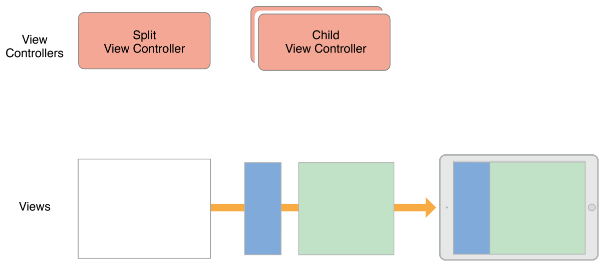

[View Controller Programming Guide for iOS 官方文档传送门](https://developer.apple.com/library/ios/featuredarticles/ViewControllerPGforiPhoneOS/index.html#//apple_ref/doc/uid/TP40007457)
本文翻译自2015-09-16版的官档。
您可以在官档结尾的Document Revision History中查阅版本。
注：【】包含的部分引自原文。

--------
### 实现容器ViewController
容器ViewController（后文简称容器）可用将多个ViewController的内容聚合到一个界面。容器通常有两种作用，一是简化界面间的导航，二是可以基于已有的内容构建新界面。UIKit中内置了几种容器，如UINavigationController、UITabBarController和 UISplitViewController。它们都可以简化界面间的导航。

#### 设计自定义容器ViewController
容器和内容ViewController是类似的，都是管理根View和内容。它们的区别在于，容器会使用其他ViewController的根view作为自己内容的一部分。容器只能取ViewController的根view作为内容，将它们嵌入自己的view树。容器会调整嵌入的根view的位置和尺寸，但根view上的view树还是由其所属的ViewController自己管理。

设计自己的容器时，要理解容器和被包含的ViewController的关系。ViewController间的关系可以体现出，它们的内容如何出现在屏幕上，以及容器内部如何管理他们。设计过程中，要问下自己以下问题：

- 容器和子ViewController各自的角色是什么？
- 有多少子ViewController会同时进行展示？
- 兄弟ViewController间有关系吗，如果有的话是什么关系？
- 子ViewController如何从容器中添加和移除？
- 子ViewController的尺寸和位置可以改变吗？什么条件下会改变？
- 容器有附加的装饰view或导航相关的view吗？
- 容器和子ViewController如何交流？除了UIViewController定义的消息外，容器需要向子ViewController报告额外的消息吗？
- 容器的外观可以配置吗，如果可以的话，如何配置？

在你定义完各对象的角色后，实现容器是比较简单的。你唯一要做的，就是在容器和子ViewController间建立明确的父子关系。父子关系能确保子ViewController能接收到相关的系统消息。除此之外，容器的大多数工作是布局和管理被包含的view，不同容器的处理也会不同。你可以将被包含的view放在容器的任何区域，并调整它们的尺寸。你也可以为容器添加额外的装饰view，或辅助界面导航的view。

##### 示例：UINavigationController
UINavigationController支持在一个层级型的ViewController间导航。导航界面同一时间只展示一个子ViewController。顶部有导航栏，可以展示当前界面在层级中的位置，并显示一个返回按钮，用于返回上一层级。如何向下一层级导航是子ViewController的任务，可能是点击相关按钮，也可能是点击相关Cell。
ViewController间的导航由UINavigationController和子ViewController共同管理。当用户点击子ViewController上的按钮或cell时，子ViewController会告知容器压入【push】新的ViewController，子ViewController会配置新ViewController的内容，而容器会管理界面切换的动画。容器也会管理导航栏，显示返回按钮来弹出最顶部的ViewController。
图5-1展示了UINavigationController和它的view们的结构。子ViewController的内容占据了大部分区域，小部分区域留给导航栏。

图5-1 导航界面的结构


不管是紧凑型布局还是常规型布局，UINavigationController在同一时间，都只展示一个子ViewController。UINavigationController会根据当前的空间来调整子ViewController的尺寸。

##### 示例：UISplitViewController 
UISplitViewController会展示两个ViewController的方式，采用主从【master-detail】的展示风格。在这种风格中，主ViewController决定了哪个ViewController作为从ViewController。两个ViewController的视觉效果可以配置，但也会受当前环境影响。在常规水平环境中，UISplitViewController会并排的显示主、从ViewController，或者在需要的时候隐藏主ViewController。在紧凑环境中，UISplitViewController 在同一时间只会显示一个ViewController。
图5-2展示了UISplitViewController在常规水平环境中的情况。UISplitViewController本身只有容器view。本例中，两个子ViewController并排的显示。这些子ViewController的view尺寸是可以配置的，本例中保持主view【as is the visibility of the master view】。

图5-2 UISplitViewController


#### 在IB（Interface Builder）中配置容器
如果想在设计阶段创建ViewController的父子关系，可以在storyboard中添加container view，如图5-3所示。container view是子ViewController内容的占位对象，使用它可以调整子ViewController的根view的尺寸和位置。

图5-3 在IB中添加container view。


当你加载包含container view的ViewController时，IB也会加载和这些container view相关的子ViewController。子ViewController和父view应该同时实例化，以便于建立父子关系。

如果你不用IB来建立父子关系，你需要写代码来将每个子ViewController加入容器ViewController。详情参考后文“在内容中添子ViewController”一节。

#### 实现自定义容器ViewController
要实现容器ViewController，你需要建立起容器ViewController和子ViewController的关系。在管理子ViewController和其view之前，就要建立好父子关系。建立关系能让UIKit意识到你的ViewController要管理子ViewController的尺寸和位置。你可以在IB中建立关系，也可以写代码实现。如果通过代码实现，你需要显式的添加和移除子ViewController。

##### 向内容中添加子ViewController
想通过代码将子ViewController加入容器ViewController的内容中，你需要按下面的步骤建立父子关系：

1. 调用容器ViewController的addChildViewController:方法。这个方法告诉UIKit你的容器ViewController要管理子ViewController的view。
2. 将子ViewController的根view加入容器ViewController的view树。这一步中，要记得设置子ViewController根view的尺寸和位置。
3. 为子ViewController的根view添加必要的约束。
4. 调用子ViewController的didMoveToParentViewController:方法。

代码清单5-1展示了容器如何将子ViewController嵌入自己。建立父子关系后，容器设置子ViewController的根view的frame，并将其加入自己的view树。设置frame是重要的，可以保证子ViewController的根view能在容器中正确的展示。添加完view后，调用子ViewController的didMoveToParentViewController:来给它一个机会来响应view所属关系的变化。

代码清单5-1 将子ViewController加入容器

```
- (void) displayContentController: (UIViewController*) content {
   [self addChildViewController:content];
   content.view.frame = [self frameForContentController];
   [self.view addSubview:self.currentClientView];
   [content didMoveToParentViewController:self];
}
```

注意到上面的示例中，你仅仅调用了子ViewController的didMoveToParentViewController方法。因为容器的addChildViewController: 方法会自动调用子ViewController的willMoveToParentViewController:。而子ViewController的根view什么时候加入容器由你决定，所以加入容器后，由你来调用didMoveToParentViewController。

如果使用自动布局，在子ViewController的根view加入容器后，再添加相关的约束。你添加的约束只能约束子ViewController的根view的尺寸和位置，不能去操作它内部的view树。

##### 移除子ViewController
想要移除子ViewController，按照下面步骤解除父子关系：

1. 调用子ViewController的willMoveToParentViewController:方法，并传nil。
2. 移除掉你在子ViewController的根view上添加的约束。
3. 从容器中移除子ViewController的根view。
4. 调用子ViewController的removeFromParentViewController方法。

移除子ViewController会永久的解除它和容器的父子关系。只有你确定不需要子ViewController时才移除它。例如，UINavigationController在压入新ViewController时，不会移除旧ViewController，只有在弹出【pop】ViewController它才会移除。

代码清单5-2展示了如何从容器中移除子ViewController。调用子ViewController的willMoveToParentViewController方法（传nil值），给了它处理变化的机会。removeFromParentViewController方法会调用子ViewController的didMoveToParentViewController:（传nil值），将子ViewController的父ViewController属性设置为nil，并将它从容器移除。

代码清单5-2 将子ViewController从容器中移除

```
- (void) hideContentController: (UIViewController*) content {
   [content willMoveToParentViewController:nil];
   [content.view removeFromSuperview];
   [content removeFromParentViewController];
}
```

##### 切换子ViewController
如果你想动画的切换两个子ViewController，可以将添加和移除合并到一个转场动画。动画执行前，确保两个ViewController都是容器的子ViewController，并让当前的ViewController知道自己将被移除。动画过程中，将新旧view移动到合适位置。动画完成后，完成子ViewController的相关操作。

代码清单5-3展示了如何使用转场动画切换两个子ViewController。实例中，新的ViewController的根view会移动到旧的ViewController的根view的位置，旧的则会移出屏幕。动画结束后，执行子ViewController相关操作。示例中，transitionFromViewController:toViewController:duration:options:animations:completion: 方法会自动更新容器的view树，因此你不需要添加或移除view。

代码清单5-3 子ViewController转场

```
- (void)cycleFromViewController: (UIViewController*) oldVC
               toViewController: (UIViewController*) newVC {
   // Prepare the two view controllers for the change.
   [oldVC willMoveToParentViewController:nil];
   [self addChildViewController:newVC];
 
   // Get the start frame of the new view controller and the end frame
   // for the old view controller. Both rectangles are offscreen.
   newVC.view.frame = [self newViewStartFrame];
   CGRect endFrame = [self oldViewEndFrame];
 
   // Queue up the transition animation.
   [self transitionFromViewController: oldVC toViewController: newVC
        duration: 0.25 options:0
        animations:^{
            // Animate the views to their final positions.
            newVC.view.frame = oldVC.view.frame;
            oldVC.view.frame = endFrame;
        }
        completion:^(BOOL finished) {
           // Remove the old view controller and send the final
           // notification to the new view controller.
           [oldVC removeFromParentViewController];
           [newVC didMoveToParentViewController:self];
        }];
```

##### 管理子ViewController的外观更新
将子ViewController添加到容器后，容器自动向子ViewController转发出现消失（willAppear等）的通知。这通常都是我们想要的，因为这样可以确保相关事件被恰当的传递。但有些场景下，默认行为不能满足我们。例如，多个子ViewController同时改变状态，你可能需要它们合并【changes】这些变化，让它们的回调更加有序。

为了接管出现消失的回调，你需要重写容器的shouldAutomaticallyForwardAppearanceMethods方法，让其返回NO。如代码清单5-4所示。返回NO告诉了UIKit，你的容器会自己将出现消失通知专递给子ViewController。

代码清单5-4 禁用自动出现消失通知转发

```
- (BOOL) shouldAutomaticallyForwardAppearanceMethods {
    return NO;
}
```

当出现通知产生时，调用子ViewController的beginAppearanceTransition:animated:或endAppearanceTransition方法。例如，你的容器有一个子ViewController，被属性child引用，你可以按5-5的代码向它转发通知：

代码清单5-5 手动向子ViewController转发出现消失通知

```
-(void) viewWillAppear:(BOOL)animated {
    [self.child beginAppearanceTransition: YES animated: animated];
}
 
-(void) viewDidAppear:(BOOL)animated {
    [self.child endAppearanceTransition];
}
 
-(void) viewWillDisappear:(BOOL)animated {
    [self.child beginAppearanceTransition: NO animated: animated];
}
 
-(void) viewDidDisappear:(BOOL)animated {
    [self.child endAppearanceTransition];
}
```

#### 构建容器ViewController的建议
设置、开发及测试新的容器ViewController都要消耗时间。尽管单个行为很简单，但ViewController整体还是很复杂的。实现自己的容器时，考虑下面的建议：

- 只访问子ViewController的根view。容器应该只访问子ViewController的根view（即ViewController的self.view返回的view）。不要访问子ViewController内部的其他view。
- 子ViewController应该尽量少的了解容器。子ViewController应该专注于自己的内容。如果容器允许子ViewController影响自己，应该使用delegate模式来处理两者的交互。
- 设计容器的阶段使用常规【regular】view（译注：理解是UIView等占位view）。使用常规view（而不是直接使用子ViewController的根view）能够更简单测试布局和转场。当常规view工作良好时，再替换为子ViewController的根view。

#### 将控制权授权给子ViewController【Delegating Control to a Child View Controller】
容器可以将部分外观控制权授权给子ViewController，你可以通过以下方式实现：

- 让子ViewController决定状态栏风格。想要将状态栏外观授权给子ViewController，你需要重写容器的childViewControllerForStatusBarStyle和childViewControllerForStatusBarHidden中的一个，或都重写。
- 让子ViewController指定自己的尺寸。使用灵活布局的容器，可以通过自ViewController的preferredContentSize属性，来决定子ViewController的尺寸。

