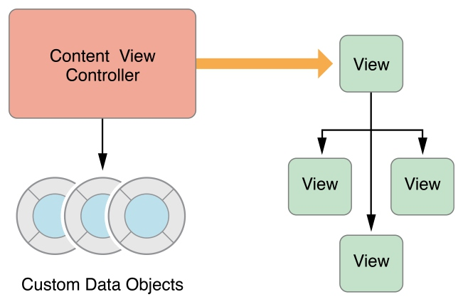

[View Controller Programming Guide for iOS 官方文档传送门](https://developer.apple.com/library/ios/featuredarticles/ViewControllerPGforiPhoneOS/index.html#//apple_ref/doc/uid/TP40007457)
本文翻译自2015-09-16版的官档。
您可以在官档结尾的Document Revision History中查阅版本。
注：【】包含的部分引自原文。

--------

## 概述
### View Controllers的角色
View controllers 是你的App的内部结构的基础。每个App至少拥有一个View Controller，大多数App拥有多个。每个View controller管理你的App的一部分界面（user interface），以及界面和底层数据（underlying data）之间的交互。View Controller还能让你的界面间过渡更加容易。

由于View Controller在你的App中扮演如此重要的角色，因此它是你所有开发工作的中心。UIViewController类定义了方法和属性来管理你的view、处理事件、协助view controller间的过渡，并协调与程序其他部分的配合。你可以生成UIViewController的子类（或子类的子类），并添加需要的代码，来实现你的App的行为。

有两种类型的view controllers:
- 内容 view controllers【Content view controller】管理着你的App的一块独立的内容，这也是你最常创建的view controllers类型。
- 容器 view controllers【Container view controllers】从其他的view controllers（一般被称作child view controllers）中收集信息，以一种更易于导航的方式或以一种不同的展现方式来展现那些view controllers的内容【and present it in a way that facilitates navigation or presents the content of those view controllers differently】。
大多数的Apps是由这两种view controllers组合而成的。

#### 管理View
view controller最重要的角色就是管理一个View树【a hierarchy of views】。每个view controller都有一个根view【root view】，根view包含【encloses】了这个view controller的所有内容。你可以把需要的view添加到根view上来展示你的内容。图1-1展示了view controller 和它的views的内建【build-in】的关系。view controller总是拥有它的根view的一个引用，每个view都拥有它的子views【subviews】的强引用【strong reference】。

图1-1 view controller 和它的views的关系

>注意：
使用outlets来访问你的view controller的view树中的其他views是个很常见的实践。view controller管理它所有views的内容，outlets让你持有需要的views的引用。当你的views从storyboard中加载后，outlets会自动的连接到实际的view对象。

内容view controller管理它自己所有的views。而容器view controller管理它自己的views以及它的子view controllers【child view controllers】的views。容器并不会管理它的孩子们的内容，它仅仅管理孩子们的根views，根据容器的设计调整根views的尺寸和位置。图1-2展示了split view controller和它的孩子们的关系。split view controller 管理着子views的尺寸和位置，而子view controller管理那些views的实际内容。

图 1-2 View controllers能管理来自其他view controllers的内容【View controllers can manage content from other view controllers. *这句话是不是有问题？】。

关于如何管理你的view controllers的views，请参考后文的管理View布局【Managing View Layout.】一节。

#### 数据调度（Marshaling）
view controller 在它的views和App的数据之间扮演着中间人的角色。UIViewController类的方法和属性让你可以管理App的可视化展现。当你子类化UIViewController时，你会向子类中添加需要的变量【variables】来管理你的数据。添加自定义的变量创建了图1-3中的关系，view controller持有着你的数据的引用，也持有着展示这些数据的views的引用。在两者之间移动数据是你的职责。

图1-3 view controller 协调【mediates】数据对象【data objects】和views

对于view controllers和数据对象，你应该始终保持清晰的责任划分。大多数确保数据结构完整性的逻辑属于数据对象的职责。view controller可能验证views收集的输入数据，并且将数据打包成数据对象需要的格式，但你应该最小化view controller管理实际数据的职责。

使用UIDocument类是将管理数据从view controller中分离出来一种方式。document对象是一种知道如何从持久化存储中读写数据的对象。当你子类化UIDocument时，你添加需要的逻辑和方法来抽取数据，并将数据传递给view controller或App的其它部分。view controller可能会存储一份数据的拷贝来更加容易的更新views，但document依然拥有真正的数据。

#### 用户交互
view controllers是响应者对象（responder objects），能够处理来自响应链的事件。尽管view controllers有处理触摸事件的能力，但它们几乎不会去处理。而一般是views来处理它们自己的触摸事件，并将结果报告给绑定的delegate或target对象的特定方法。这些delegte或target对象，通常就是view controllers。因此view controller中的通常在delegate方法或action方法中处理事件。
更多的关于在你的view controller中实现action方法的信息，请参考后文中的“处理用户交互”。更多的关于处理其他类型事件的信息，参考[事件处理指南官方文档【Event Handling Guide for iOS】](https://developer.apple.com/library/ios/documentation/EventHandling/Conceptual/EventHandlingiPhoneOS/Introduction/Introduction.html#//apple_ref/doc/uid/TP40009541)。

#### 资源管理
view controller为它的所有的views以及它所创建的所有对象负责。UIViewController会自动处理view管理的大多数方面。例如，UIKit会自动释放不再需要的view相关的资源。当你子类化UIViewController，你有责任管理你显式穿件的对象。
当内存不错的时候，UIKit会要求apps释放不再需要的资源。一种方式是通过调用你的view controller的didReceiveMemoryWarning方法。你应该使用这个方法来移除对不再需要或是很容易再次创建的对象的引用。例如，你可以使用这个方法来移除缓存诗句。内存不足时释放掉尽可能多的内存是很重要的事。消耗内存太多的Apps会被系统强制终止以恢复内存。

#### 自适应（Adaptivity）
view controller有责任来展示它的views的数据，并且有责任根据底层环境的不同，来适配展示效果。每个iOS app都应该能在iPad及几个不同尺寸上的iPhone上运行【Every iOS app should be able to run on iPad and on several different sizes of iPhone】。和为每种设备提供不同的view controllers及view树相比，更简单的方式是使用一个能根据空间变化需对views进行适配的view controller。
在iOS中，view controllers需要处理粗粒度【coarse-grained】变化和细粒度【fine-grained】变化。粗粒度变化发生在view controller的特性【traits】发生变化。特性是一种描述整体环境变化的属性【attributes】，例如显示的缩放【display scale】。view controller最重要的两个特性是水平和竖直的尺寸类别【size classes】，尺寸类别指示出view controller在特定尺寸下的空间。你可以根据size classes的变化来改变你的views的布局，就像图1-4所示。当水平尺寸类别是常规【regular】时，view controller有额外的水平空间来排列它的内容。当水平尺寸类别是紧凑【compact】，view controller可能竖直的排列它的内容。

图1-4 根据size class变化适配views

在一个给定的尺寸类别中，任何时候都可能发生细粒度的变化。当用户将iPhone从竖直旋转到水平时，尺寸类别可能没有变化，不过屏幕尺寸【screen dimensions，个人理解为宽高比】会变化。当你使用自动布局【Auto Layout】时，UIKit会自动的调整views的尺寸和位置来匹配新的屏幕尺寸。view controller也可以根据需要做额外的调整。
更多的关于自适应性的信息，请参考后文中的“自适应模型【The Adaptive Model】”。

