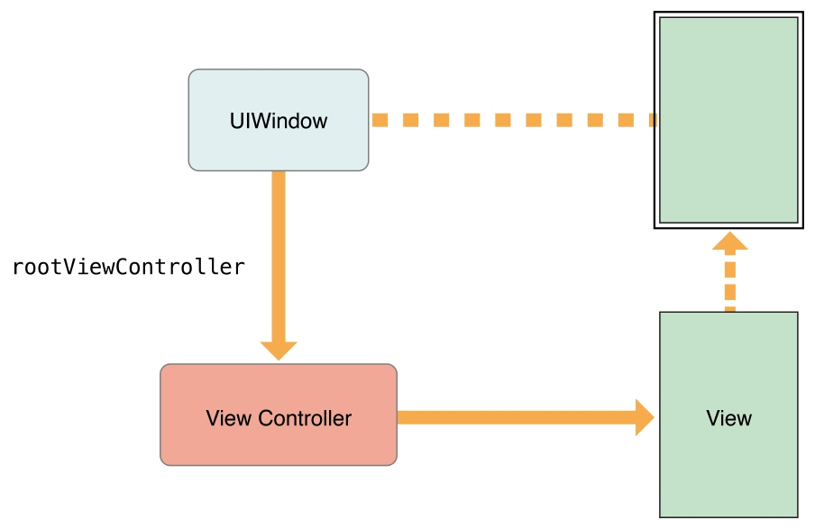

[View Controller Programming Guide for iOS 官方文档传送门](https://developer.apple.com/library/ios/featuredarticles/ViewControllerPGforiPhoneOS/index.html#//apple_ref/doc/uid/TP40007457)
本文翻译自2015-09-16版的官档。
您可以在官档结尾的Document Revision History中查阅版本。
注：【】包含的部分引自原文。

--------
### View Controller 树【Hierarchy】
view controllers之间的关系决定了【define】每个view controller必须的行为。UIKit希望你按规定的方式使用view controller。保持恰当的view controller间的关系能确保当需要的时候，某些自动的行为可以传递给正确的view controller。如果你破坏规定的包含或展示关系，你的App部份模块会停止预期的行为【portions of your app will stop behaving as expected】。

#### root view controller
root view controller是view controller树的锚【anchor】。每个window都有一个内容可以填满window的rootview controller。root view controller定义了可以被用户看到的初始的内容。图2-1展示了root view controller和window的关系。window本身没有可视化的内容，由view controller的view来提供所有的内容。

图2-1 root view controller 和 window

root view controller可以通过UIWindow对象的rootViewController属性访问。如果你使用storyboard来配置view controllers的话，UIKit会在launch时自动的设置这个属性。如果你使用代码来实现，你必须自己设置root view controller。
