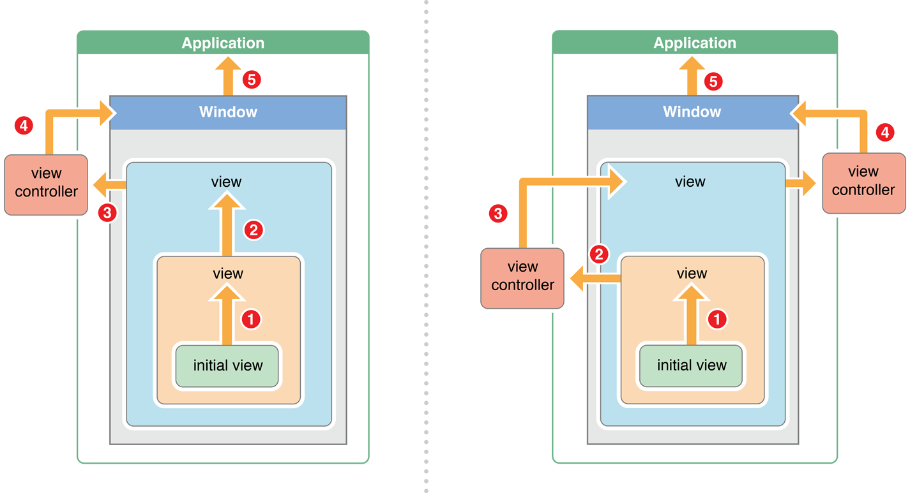

[NextPrevious Event Delivery: The Responder Chain 官档传送门](https://developer.apple.com/library/content/documentation/EventHandling/Conceptual/EventHandlingiPhoneOS/event_delivery_responder_chain/event_delivery_responder_chain.html#//apple_ref/doc/uid/TP40009541-CH4-SW2)
本文是Event Handling Guide for iOS中的一篇，翻译自2016-03-21版的官档。
您可以在官档结尾的Document Revision History中查阅版本。
注：【】包含的部分引自原文。

------
## 事件传递：响应链
设计App时，你可能想动态的响应事件。例如，一次触摸可能关系到屏幕上的许多对象，你需要决定哪个对象来响应这个事件，并了解这个对象是如何接受到事件的。
当用户产生的事件出现时，UIKit会创建一个包含了相关信息的事件对象，并将事件对象放入前台App【active app】的事件队列里。对于触摸事件来说，这个对象是个封装了一组触摸动作的UIEvent对象。对于动作【motion】事件来说，事件类型取决于你使用的framework，以及你感兴趣的动作种类。
事件会沿着特定的路径传递，直到遇到能处理它的对象。首先，App中单例的UIApplication对象，会从事件队列中取出事件并派发出去。典型地，它会传递给App的key window对象，key window对象将事件传递给初始处理对象。初始处理对象依赖事件的种类，如下：
- 触摸事件。对于触摸事件，key window 先尝试将事件传递给事件发生时所在的view，也就是hit-test view。查找hit-test view的过程叫做hit-testing，在后文的Hit-Testing Returns the View Where a Touch Occurred 章节有详细描述。
- 动作事件及远程控制事件。对于这类事件，key window将摇动事件、远程控制事件等传递给first responder。first responder会在后文 The Responder Chain Is Made Up of Responder Objects 章节详细介绍。

## Hit-Testing 返回事件发生时所在的View【Testing Returns the View Where a Touch Occurred】
iOS 使用 hit-testing 来查找触摸事件发生时所在的view。Hit-testing检查触摸点是否落在相关view的bounds中。如果落在其中，则递归地检查其子view。view树中包含触摸点的最下层的节点，被作为hit-test view。iOS找到了hit-test view，就会把事件传递它来处理。
举例说明，我们假设用户处理了图2-1中的View E。iOS通过检查子view来决定hit-test view的执行过程如下：

1. 触摸落在view A的bounds中，检查子view B和C。
2. 触摸不落在B中，但落在C中，检查子view D和E。
3. 触摸不落在D中，但落在E中，E已经是view树中包含触摸的最底层节点，它即是hit-test view。

图 2-1 Hit-testing返回被触摸的sub view

hitTest:withEvent:方法返回给定的CGPoint和UIEvent的hit test view。hitTest:withEvent:方法首先调用pointInside:withEvent:，如果传递给hitTest:withEvent:的point落在view的bounds中，则pointInside:withEvent:返回YES。然后 hitTest:withEvent: 方法会对返回YES的view的子views递归调用hitTest:withEvent: 。

如果传递给hitTest:withEvent:的点不在view的bounds中，则pointInside:withEvent: 返回NO，这个点会被忽略，hitTest:withEvent:返回ni。如果一个节点返回nil，则它为根节点的view子树都会被忽略。因为一个触摸没发生在一个view上的话，也不会发生在其子view上。这也意味着子view超出父view的区域无法接受到触摸事件，要求触摸点也必须落在其父view上。这个问题在子view的 clipsToBounds 设置为NO时会出现。

> 注意 触摸事件整个生命周期都和它的hit-test view关联，即使触摸事件后期移动到了view的bounds外也是如此。【A touch object is associated with its hit-test view for its lifetime, even if the touch later moves outside the view.】（我没完全理解这句话）
hit-test view获得了优先处理事件的机会。如果它选择不处理，可以在响应链上传递此事件，知道系统找到了一个可以处理事件的对象。响应链我们在后文的 The Responder Chain Is Made Up of Responder Objects 中会详细介绍。

##  响应对象构成响应链【The Responder Chain Is Made Up of Responder Objects】
多种类型的事件都依赖响应链来传递。响应链是一组链接在一起的响应对象。它以first responder为起始，以application对象为结束。如果first responder 不处理事件，它将事件传递给响应链的下一个响应对象。
响应对象是可以处理事件的对象。UIResponder是响应对象的基类，它定义的接口不仅包含事件处理，还包含通用的响应行为。UIApplication, UIViewController, 和 UIView都是响应对象，这意味着所有的view和大多数的key controlller【key controller】(为什么不是描述为所有的view controller对象)。注意Core Animation库中的layer不是响应对象。

first responder被设计为优先处理事件。典型的，first responder是个view。对象想成为first responder要完成两件事：
1. 重写canBecomeFirstResponder方法，返回YES。
2. 接到becomeFirstResponder消息，需要的时候，对象可以对自己发送这个消息。

> 注意：确保你的App在指定first responder之前已经建立好了object graph（我的理解是对象间引用已建立完毕）。例如，你一般在viewDidAppear: 中调用becomeFirstResponder方法，而不是在viewWillAppear:中，此时object graph尚未建立，调用becomeFirstResponder会返回NO。

事件不是唯一依赖响应链的对象，下述这些都依赖于响应链：
- 触摸事件：如果hit-test view不处理事件，事件沿着以hit-test view为起点的响应链传递。
- 动作事件（Motion）：如果选择用UIKit处理摇动事件，必须重写first responder 的motionBegan:withEvent:或motionEnded:withEvent:方法，Detecting Shake-Motion Events with UIEvent章节中有详细描述。
- 远程控制事件：first responder必须重写remoteControlReceivedWithEvent: 方法。
- Action消息：当用户操作一个control控件，如按钮或switch时，如果target为nil，则消息会被传递给响应链的first responder，first responder可能是这个控件本身。
- 编辑菜单消息：当用户触发编辑菜单命令时，iOS会利用响应链来查找实现了相关方法（如剪切、复制或粘贴）的对象。更多描述请参考 Displaying and Managing the Edit Menu 章节及示例工程CopyPasteTile。
- 文本编辑。用户点击text field或text view时，view会自动成为 first responder。默认情况下，此时虚拟键盘会自动弹出，并且view成为输入焦点。如果需要的话，你可以用自定义的input view替换掉虚拟键盘。你也可以给任意的响应对象添加自定义的input view。更多的描述，请参考Custom Views for Data Input 章节。

UIKit会自动见text field或text view设置为first responder，但其他的view需要你自己调用becomeFirstResponder来设置。

## 响应链会沿着特定的路径传递事件【The Responder Chain Follows a Specific Delivery Path】
如果初始处理对象（如hit-test view或first responder）不处理事件，UIKit就会将事件传递给响应链的下一个响应对象。响应对象会决定自己是否处理事件，如果不处理的话，会调用 nextResponder 方法，将事件传递给下一个响应对象。这个操作一直重复直到有响应对象决定处理事件， 或者已经没有更多的响应对象了。
响应链操作始于iOS探测到事件，并将其传递给初始处理对象。初始处理对象一般是view，它有优先处理事件的机会。
图 2-2 展示了两个配置不同的App（我的理解为View Controller及view树的构造不同）的事件传递路径，每个App根据自己的构造有不同传输路径，但它们遵循的理念【heuristics】（引申了下）是相同的。

图 2-2 

左边的App中，事件传输路径如下：
1.  initial view（初始处理对象）尝试处理事件，如果它选择不处理，它将事件传递给它的父view。因为它并非view controller的根view【the top most view in its view controller’s view hierarchy】。
2. 父view尝试处理事件，如果它选择不处理，它将事件传递给它的父view。因为它依然不是view controller的根view。
3. 本层的view已经是view controller的根view，它尝试处理事件，如果不处理，它将事件传递给它的view controller。
4. view controller尝试处理，如果不处理，传递给key window。
5. key window尝试处理，如果不处理，传递给 application 对象。
6. 如果application对象不处理事件，则将事件丢弃。

右边的App中（有嵌套的view controller），事件传输路径如下：
1. view传递事件直到view controller的根view。
2. view controller的根view传递事件给view controller。
3. view controller传递事件给它根view的父view（view controller有嵌套，故子view controller的根view是add到父view controller的某个view上的）。重复上述过程知道到达App 的root view controller。
4. root view controller传递事件给key window。
5. key window传递事件给application。

> 重要：如果你使用UIKit实现了自定义的view来处理远程控制事件、action消息、摇动事件，或者编辑菜单消息，不要直接调用nextResponder方法传递事件，而是应该调用父类的相关事件处理方法。让UIKit来为你处理响应链事件传递。

