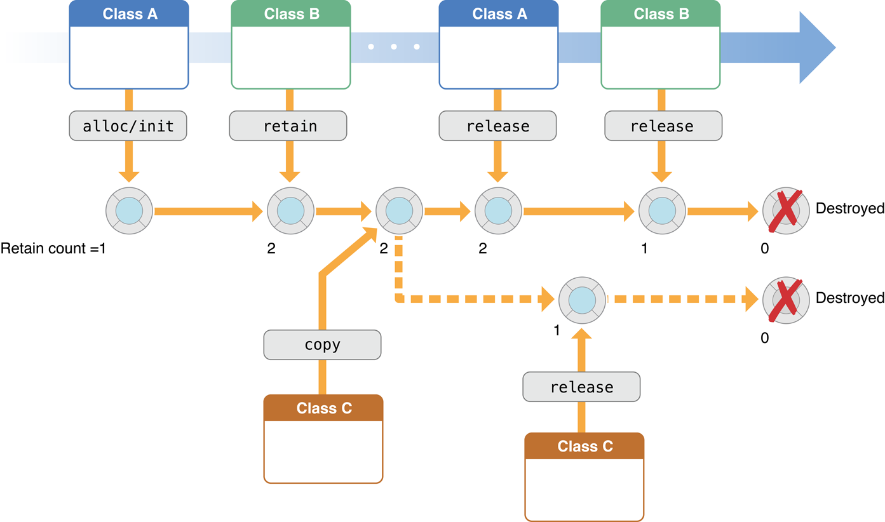

[Advanced Memory Management Programming Guide 官档传送门](https://developer.apple.com/library/content/documentation/Cocoa/Conceptual/MemoryMgmt/Articles/MemoryMgmt.html#//apple_ref/doc/uid/10000011-SW1)

本文翻译自2012-07-17版的官档。
您可以在官档结尾的Document Revision History中查阅版本。
注：【】包含的部分引自原文。

## 概述
### 关于内存管理
内存管理是指你的App运行时，分配内存、使用内存、以及使用完毕释放内存的处理。编写良好的程序会尽量少的使用内存。在Objective-C中，内存管理可被视为一种为数据和代码分配优先的内存资源的方式。读完这篇文档后，你会拥有内存管理的相关知识。你可以精确控制对象的生命周期，并在不需要的时候释放它们。
尽管内存管理通常被认为是针对一个对象的，但实际上我们的目标是管理对象图【object graphs】，你应该确保内存中只有你需要的对象。

### 概览【At a Glance】
Objective-C提供了两种内存管理的方法。
1. 手动持有释放，简称MRR。你需要自己管理你拥有的对象，来精确的控制内存。这是用引用计数的机制来实现的。Foundation中的NSObject类提供了与runtime环境的结合。
2. 自动引用计数，简称ARC。系统使用了和MRR一样的机制，不过它会在编译期自动在合适的位置插入内存管理语句。我们强烈推荐你使用ARC，使用了ARC，不需要再去了解相关的底层知识，当然，了解相关知识有时候也是有帮助的。更多关于ARC的知识，请阅读[Transitioning to ARC Release Notes](https://developer.apple.com/library/content/releasenotes/ObjectiveC/RN-TransitioningToARC/Introduction/Introduction.html#//apple_ref/doc/uid/TP40011226)

### 避免内存相关问题的优秀实践
常见的内存问题有这样两种：
- 释放或重写了仍在使用的数据。这会导致内存数据损坏，很可能会导致程序崩溃，甚至损坏用户的数据。
- 没有释放不再使用的内存，导致内存泄露。内存泄露就是分配了内存，但使用完毕后没有释放。内存泄露会导致你的程序使用的内存持续增长，可能降低系统性能，甚至程序被系统强制终止。

从引用计数的角度去看内存管理，你可能适得其反。因为你的注意力放在了内存管理实现细节上，而没有放在你的实际目标上。相反，你应该从对象间关系或对象图的角度去看内存管理。

Cocoa使用了明确的命名惯例来提示你，在什么情况下，方法返回的对象会被你持有。
参见 内存管理策略【Memory Management Policy】一章

尽管基本的策略很明确，但还有一些实践让你可以更加容易的管理内存。让你的程序更加可靠和健壮，并能减少你申请分配的内存数量（意译，原文minimizing its resource requirements）。
参见 实践中的内存管理【Practical Memory Management】一章

自动释放池block提供了一种机制，让你可以“延期”给对象发送release消息。典型的应用场景是你想放弃对一个对象的持有，又不想让它马上被释放（例如你的方法返回了一个对象）。有些场合你需要有自己的自动释放池block。
参见 使用自动释放池blcok【Using Autorelease Pool Blocks】一章

### 使用分析工具调试内存问题
你可以使用Xcode内置的Clang静态分析工具，在编译期定位一些内存问题。
- Technical Note TN2239, iOS Debugging Magic中描述了很多工具和技术，实践中NSZombie可以协助寻找过度释放的对象。
- 你可以使用Instruments来追踪引用计数事件并查找内存泄露。更多描述请参考[Collecting Data on Your App.](https://developer.apple.com/library/content/documentation/DeveloperTools/Conceptual/InstrumentsUserGuide/TheInstrumentsWorkflow.html#//apple_ref/doc/uid/TP40004652-CH5)